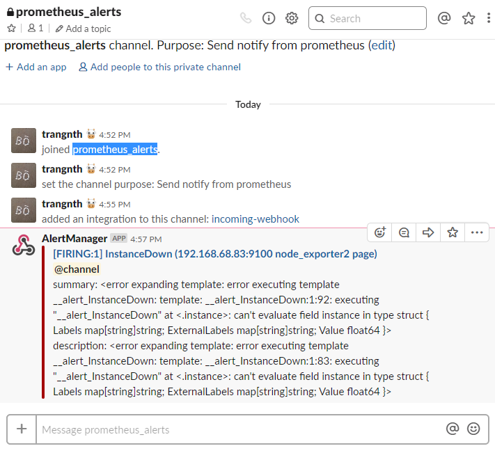
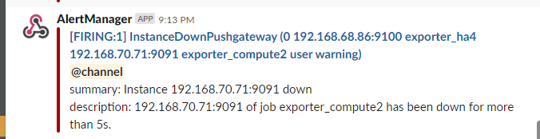
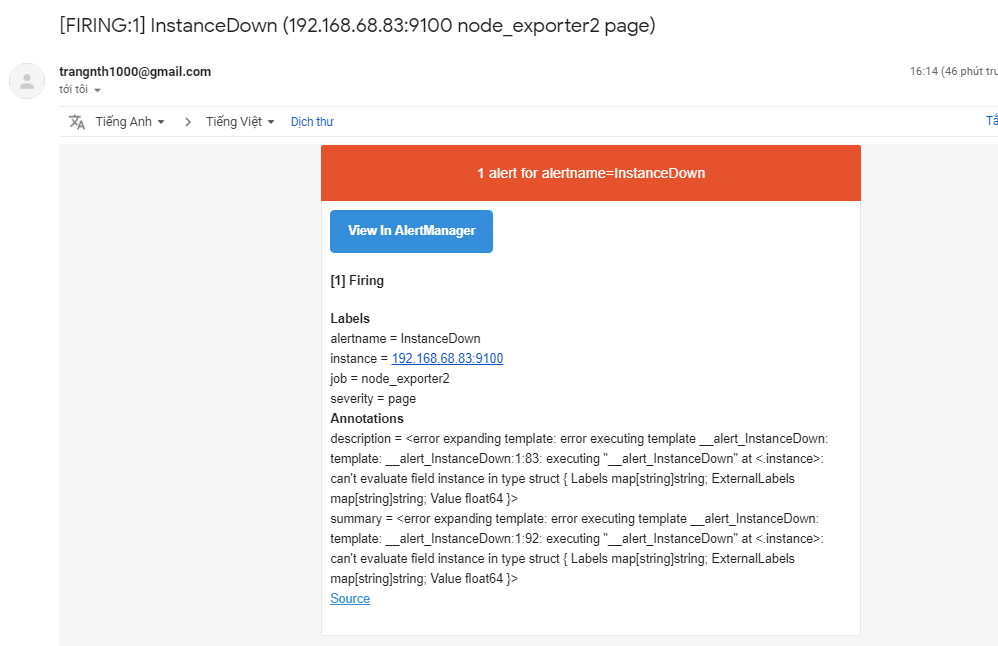

# AlertManager

## 1. Tổng quan về Alerting

Alerting với Prometheus được chia làm hai phần. Alerting rules trong Prometheus server gửi alerts tới Alertmanager. Alertmanager sẽ quản lý việc cảnh báo, bao gồm silencing, inhibition, aggregation và gửi cảnh báo qua các phương thức như email, on-call notification systems, and chat platforms.

Các bước chính để set up alert và notifications là;

* Setup và configure Alertmanager
* Configure Prometheus để nói chuyện với Alertmanager
* Tạo alerting rules trong Prometheus


## 2. Alertmanager

Alertmanager xử lý cảnh báo được gửi bởi ứng dụng như là Prometheus server. Nó có các cơ chế Grouping, inhibition, silence.

* **Grouping**: Phân loại cảnh báo có các tính chất tương tự với nhau. Điều này thực sự hữu ích trong một hệ thống lớn với nhiều thông báo được gửi đồng thời. 
	
	Ví dụ: Một hệ thống với nhiều server mất kết nối đến cơ sở dữ liệu, thay vì rất nhiều cảnh báo được gửi về Alertmanager thì Grouping giuos cho việc giảm số lượng cảnh báo trùng lặp, thay vào đó là một cảnh báo để chúng ta có thể biết được chuyện gì đang xảy ra với hệ thống của bạn. 

* **Inhibition**: là một khái niệm về việc chặn thông báo cho một số cảnh báo nhất định nếu các cảnh báo khác đã được kích hoạt.

	Ví dụ: Một cảnh báo đang kích hoạt, thông báo cluster không thể truy cập (not reachable). Alertmanager có thể được cấu hình là tắt các cảnh báo khác liên quan đến cluster này nếu cảnh báo đó đang kích hoạt. Điều này lọc bớt những cảnh báo không liên quan đến vấn đề hiện tại.

* **Silence**: Silence là một cách đơn giản để tắt cảnh báo trong một thời gian nhất định. Nó được cấu hình dựa trên việc match với các điều kiện thì sẽ không có cảnh báo nào được gửi khi đó.

* **High avability**: Alertmanager hỗ trợ cấu hình để tạo một cluster với độ khả dụng cao.


## 3. Cấu hình Alertmanager cảnh báo qua mail và slack

### Bước 1: Cài đặt

Thực hiện theo các command như sau:

```sh
useradd --no-create-home --shell /bin/false alertmanager
cd /opt
wget https://github.com/prometheus/alertmanager/releases/download/v0.17.0/alertmanager-0.17.0.linux-amd64.tar.gz

tar xvf alertmanager-0.17.0.linux-amd64.tar.gz

mv alertmanager-0.17.0.linux-amd64/alertmanager /usr/local/bin/
mv alertmanager-0.17.0.linux-amd64/amtool /usr/local/bin/

chown alertmanager:alertmanager /usr/local/bin/alertmanager
chown alertmanager:alertmanager /usr/local/bin/amtool

rm -rf alertmanager-0.17.0.linux-amd64*
cd -

mkdir /etc/alertmanager
chown alertmanager:alertmanager /etc/alertmanager
```

### Bước 2: Cấu hình các thông tin cơ bản để alertmanager có thể gửi cảnh báo qua email và slack

Chỉnh sửa file `/etc/alertmanager/alertmanager.yml` như sau:

```sh
global:
  smtp_smarthost: 'smtp.gmail.com:587'
  smtp_from: 'trangnth1000@gmail.com'
  smtp_auth_username: 'username'
  smtp_auth_password: 'password'

  slack_api_url: 'web_hooks_api'

route:
  group_by: [alertname, datacenter, app]
  receiver: 'team-1'

receivers:
  - name: 'team-1'
    email_configs:
    - to: 'bosua666@gmail.com'
    slack_configs:
    - channel: '#prometheus_alerts'
      text: "<!channel> \nsummary: {{ .CommonAnnotations.summary }}\ndescription: {{ .CommonAnnotations.description }}"
```

Bạn cần thay đổi `smtp_auth_username`, `smtp_auth_password` và `slack_api_url` cho phù hợp.

Cấp quyền cho file cấu hình:

	chown alertmanager:alertmanager /etc/alertmanager/alertmanager.yml

### Bước 3: Tạo rule alert

Tạo file khai báo rule với nội dung như sau:

```sh
touch /etc/prometheus/alert.rules.yml
chown prometheus:prometheus /etc/prometheus/alert.rules.yml
cat <<EOF > /etc/prometheus/alert.rules.yml
groups:
- name: Instances
  rules:
  - alert: InstanceDown
    expr: up == 0
    for: 10s
    labels:
      severity: page
    # Prometheus templates apply here in the annotation and label fields of the alert.
    annotations:
      description: '{{ $labels.instance }} of job {{ $labels.job }} has been down for more than 10 s.'
      summary: 'Instance {{ $labels.instance }} down'
EOF
chown prometheus:prometheus /etc/prometheus/alert.rules.yml
```

Hệ thống cảnh báo khi máy client mất kết nối trong 10s

Để check syntax ta thực hiện:

```sh
[root@prometheus ~]# promtool check rules /etc/prometheus/alert.rules.yml
Checking /etc/prometheus/alert.rules.yml
  SUCCESS: 1 rules found
```

### Bước 4: Khai báo service alertmanager với prometheus

Thêm các dòng dưới đây và file `/etc/prometheus/prometheus.yml`

```sh
rule_files:
  - alert.rules.yml

alerting:
  alertmanagers:
  - static_configs:
    - targets:
      - localhost:9093
```

Sửa lại phần `ExecStart` trong file `/etc/systemd/system/prometheus.service`

```sh
ExecStart=/usr/local/bin/prometheus \
    --config.file /etc/prometheus/prometheus.yml \
    --storage.tsdb.path /var/lib/prometheus/ \
    --web.console.templates=/etc/prometheus/consoles \
    --web.console.libraries=/etc/prometheus/console_libraries
    --web.external-url=http://192.168.70.71
```

### Bước 5: Chạy alertmanager dưới systemd

Tạo một file `/etc/systemd/system/alertmanager.service` với nội dung như sau:

```sh
[Unit]
Description=Alertmanager
Wants=network-online.target
After=network-online.target

[Service]
User=alertmanager
Group=alertmanager
Type=simple
WorkingDirectory=/etc/alertmanager/
ExecStart=/usr/local/bin/alertmanager --config.file=/etc/alertmanager/alertmanager.yml --web.external-url http://192.168.70.71:9093

[Install]
WantedBy=multi-user.target
```

**Lưu ý**: `--web.external-url` là địa chỉ ip của alertmanager

Khởi động service:

```sh
systemctl daemon-reload
systemctl restart prometheus
systemctl start alertmanager
systemctl enable alertmanager
```

### Bước 6: Kiểm tra cấu hình đã hoạt động chưa

Thực hiện tắt máy client đi một lúc và đợi xem có thông báo không.








## 4. Configuration 

### Configuration file

Thông thường thì configuration file được đặt tại `/etc/alertmanager/alertmanager.yml`, nhưng nếu muốn chỉ định alertmanager thực thi với file config khác thì chỉ định như sau:

```sh
./alertmanager --config.file=simple.yml
```

File được viết với định dạng YAML, được định nghĩa bởi sơ đồ mô tả dưới đây. Các tham số là tùy chọn, mặc định thì không có bất cứ tham số nào được set.

Các placeholders chung được định nghĩa như sau:

* `<duration>`: a duration matching the regular expression [0-9]+(ms|[smhdwy])
* `<labelname>`: a string matching the regular expression [a-zA-Z_][a-zA-Z0-9_]*
* `<labelvalue>`: a string of unicode characters
* `<filepath>`: a valid path in the current working directory
* `<boolean>`: a boolean that can take the values true or false
* `<string>`: a regular string
* `<secret>`: a regular string that is a secret, such as a password
* `<tmpl_string>`: a string which is template-expanded before usage
* `<tmpl_secret>`: a string which is template-expanded before usage that is a secret

Các placeholders khác được chỉ định riêng.

Ví dụ một file cấu hình ở đây [AlertConfigExample.yml](../config/AlertConfigExample.yml)

Các tham số được chỉ dịnh cấu hình trong `global` sẽ có giá trị trong tất cả các phần khác. Chúng được thiết lập mặc định cho tất cả các section cấu hình khác.

```sh
global:
  # ResolveTimeout is the time after which an alert is declared resolved
  # if it has not been updated.
  [ resolve_timeout: <duration> | default = 5m ]

  # The default SMTP From header field.
  [ smtp_from: <tmpl_string> ]
  # The default SMTP smarthost used for sending emails, including port number.
  # Port number usually is 25, or 587 for SMTP over TLS (sometimes referred to as STARTTLS).
  # Example: smtp.example.org:587
  [ smtp_smarthost: <string> ]
  # The default hostname to identify to the SMTP server.
  [ smtp_hello: <string> | default = "localhost" ]
  [ smtp_auth_username: <string> ]
  # SMTP Auth using LOGIN and PLAIN.
  [ smtp_auth_password: <secret> ]
  # SMTP Auth using PLAIN.
  [ smtp_auth_identity: <string> ]
  # SMTP Auth using CRAM-MD5. 
  [ smtp_auth_secret: <secret> ]
  # The default SMTP TLS requirement.
  [ smtp_require_tls: <bool> | default = true ]

  # The API URL to use for Slack notifications.
  [ slack_api_url: <secret> ]
  [ victorops_api_key: <secret> ]
  [ victorops_api_url: <string> | default = "https://alert.victorops.com/integrations/generic/20131114/alert/" ]
  [ pagerduty_url: <string> | default = "https://events.pagerduty.com/v2/enqueue" ]
  [ opsgenie_api_key: <secret> ]
  [ opsgenie_api_url: <string> | default = "https://api.opsgenie.com/" ]
  [ hipchat_api_url: <string> | default = "https://api.hipchat.com/" ]
  [ hipchat_auth_token: <secret> ]
  [ wechat_api_url: <string> | default = "https://qyapi.weixin.qq.com/cgi-bin/" ]
  [ wechat_api_secret: <secret> ]
  [ wechat_api_corp_id: <string> ]

  # The default HTTP client configuration
  [ http_config: <http_config> ]

# Files from which custom notification template definitions are read.
# The last component may use a wildcard matcher, e.g. 'templates/*.tmpl'.
templates:
  [ - <filepath> ... ]

# The root node of the routing tree.
route: <route>

# A list of notification receivers.
receivers:
  - <receiver> ...

# A list of inhibition rules.
inhibit_rules:
  [ - <inhibit_rule> ... ]
```

### <inhibit_rule>

Định dạng:

```sh
# Matchers that have to be fulfilled in the alerts to be muted.
target_match:
  [ <labelname>: <labelvalue>, ... ]
target_match_re:
  [ <labelname>: <regex>, ... ]

# Matchers for which one or more alerts have to exist for the
# inhibition to take effect.
source_match:
  [ <labelname>: <labelvalue>, ... ]
source_match_re:
  [ <labelname>: <regex>, ... ]

# Labels that must have an equal value in the source and target
# alert for the inhibition to take effect.
[ equal: '[' <labelname>, ... ']' ]
```

## 5. Cấu hình Inhibition rules

* Trong trường hợp sử dụng pushgateway, prometheus sẽ pull metric từ pushgateway, khi đó sẽ không lấy được metric `up` (state của client) để biết được nó có down hay không, nên khi đó, tôi sử dụng cách kiểm tra trong vòng 5p xem metric cpu time có thay đổi hay không, nếu không thì báo down. Với việc cảnh báo CPU vượt ngưỡng, tôi sử dụng hàm `irate`, nếu instance down, metric không đẩy về pushgateway, nhưng pushgateway không xóa metric đó, và prom vẫn sẽ pull được các metric này với các giá trị không đổi, nên %CPU usage sẽ là 100%. Cảnh báo CPU sẽ báo liên tục trong khi máy không còn hoạt động.

* Để giải quyết cần thực hiện cấu hình alertmanager bỏ qua các cảnh báo liên quan nếu instance down.

**Cấu hình**

```sh
inhibit_rules:
- source_match:
    alertname: 'InstanceDownPushgateway'
  target_match_re:
    alertname: '^.+'
  equal: ['job', 'instance', 'exported_job', 'exported_instance']
```

Ví dụ file cấu hình đầy đủ như sau:

```sh
[root@trang-70-71 ~]# cat /etc/prometheus/alert.rules.yml
groups:
- name: Instances
  rules:
  - alert: OutOfMemory
    expr: (node_memory_MemFree_bytes + node_memory_Cached_bytes + node_memory_Buffers_bytes) / node_memory_MemTotal_bytes * 100 < 5
    for: 30s
    labels:
      severity: warning
    annotations:
      summary: "Out of memory (instance {{ $labels.instance }})"
      description: "Node memory is filling up (< 5% left)\n  VALUE = {{ $value }}\n  LABELS: {{ $labels }}"

  - alert: OutOfCPU
    expr: (count(node_cpu_seconds_total{exported_job=~".*", mode=~"user"}) by(exported_job) - on (exported_job) (sum by (exported_job) (irate(node_cpu_seconds_total{mode='idle',exported_job=~".+"}[5m])))) * 100 / on (exported_job) count(node_cpu_seconds_total{exported_job=~".*", mode=~"user"}) by(exported_job) > 90
    for: 30s
    labels:
      severity: warning
    annotations:
      summary: "Out of CPU (instance {{ $labels.instance }})"
      description: "Node cpu is filling up (< 10% left)\n  VALUE = {{ $value }}\n  LABELS: {{ $labels }}"

  - alert: InstanceDownPushgateway
    expr: rate(node_cpu_seconds_total{exported_instance=~".+", cpu="0", mode="user"}[1m]) == 0
    for: 5s
    labels:
      severity: warning
    # Prometheus templates apply here in the annotation and label fields of the alert.
    annotations:
      description: '{{ $labels.instance }} of job {{ $labels.job }} has been down for more than 5s.'
      summary: 'Instance {{ $labels.instance }} down'


[root@trang-70-71 ~]# cat /etc/alertmanager/alertmanager.yml
global:
  smtp_smarthost: 'smtp.gmail.com:587'
  smtp_from: 'trangxxx@gmail.com'
  smtp_auth_username: 'trangxxx@gmail.com'
  smtp_auth_password: 'xxxx'
  slack_api_url: 'https://hooks.slack.com/services/Txxxx'

route:
  group_by: [alertname, datacenter, app]
  receiver: 'team-telegram'
  group_wait: 30s
  group_interval: 5m
  repeat_interval: 1h

receivers:
  - name: 'team-telegram'
    email_configs:
    - to: 'boxxx@gmail.com'
    slack_configs:
    - channel: '#prometheus_alerts'
      text: "<!channel> \nsummary: {{ .CommonAnnotations.summary }}\ndescription: {{ .CommonAnnotations.description }}"

inhibit_rules:
- source_match:
    alertname: 'InstanceDownPushgateway'
  target_match_re:
    alertname: '^.+'
  equal: ['job', 'instance', 'exported_job', 'exported_instance']
```


## Tham khảo

Tìm hiểu thêm về send notify qua telegram: 

[1] https://github.com/metalmatze/alertmanager-bot

[2] https://github.com/inCaller/prometheus_bot
