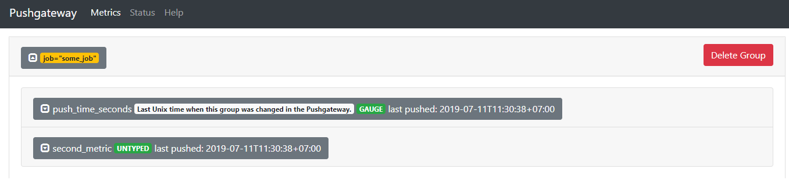
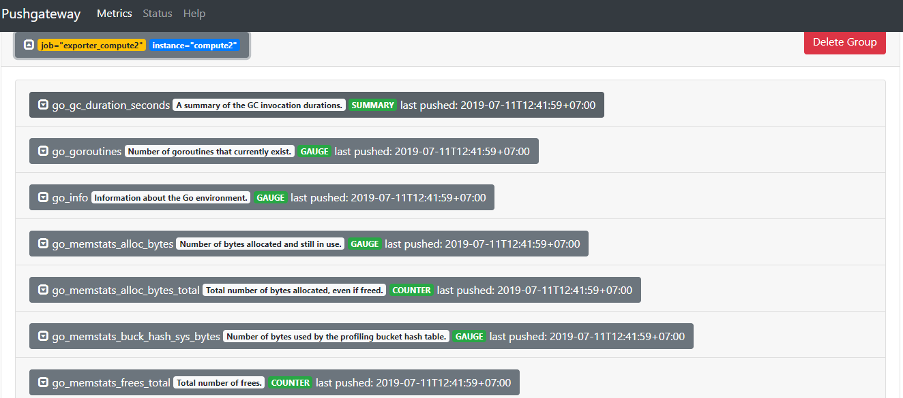
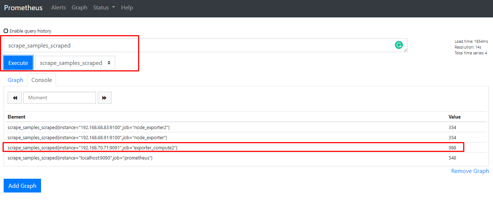
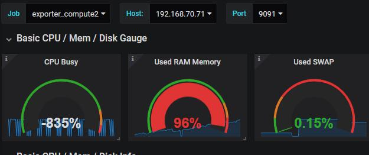

# Ghi chép cấu hình Pushgateway


## 1. Tổng quan


Pushgateway là một service trung gian cho phép bạn push metrics từ các jobs mà không thể scraped, push time series từ short-lived service-level batch jobs tới các service trung gian để Prometheus có thể scrape.

Đôi khi bạn có các applications hoặc jobs không trực tiếp export metrics. Các ứng dụng đó cũng không được thiết kế cho việc đó (ví dụ các batch jobs), hoặc bạn có thể lựa chọn không lấy các metric trực tiếp từ các ứng dụng của mình, khi đó bạn sẽ cần tới push gateway để làm trung gian.

## 2. Cài đặt Pushgateway

Ở đây mình cài đặt Pushgateway bằng cách build từ Source, sau đó sử dụng Go để setup.

### Bước 1: Cài đặt ban đầu

```sh
yum install git golang -y
```


### Bước 2: Tải source code trên github về

```sh
cd /opt
git clone https://github.com/prometheus/pushgateway
cd pushgateway
export PATH=$PATH:$(go env GOPATH)/bin
export GOPATH=$(go env GOPATH)
make clean
make
```

Đợi một lúc cho quá trình build thành công, sau đó chạy thử Pushgateway:

```sh
[root@trang-70-71 pushgateway]# ./pushgateway
level=info ts=2019-07-11T04:23:08.825Z caller=main.go:70 msg="starting pushgateway" version="(version=0.8.0, branch=master, revision=9e7f510e48497bf3598f36f0c4822c33af7dd1c9)"
level=info ts=2019-07-11T04:23:08.825Z caller=main.go:71 build_context="(go=go1.11.5, user=root@trang-70-71, date=20190711-01:58:02)"
level=info ts=2019-07-11T04:23:08.826Z caller=main.go:113 listen_address=:9091
```

### Bước 3: Test

Thử send một sample đơn giản vào group với định danh là `{job="some_job"}`

```sh
echo "second_metric 99" | curl --data-binary @- http://192.168.70.71:9091/metrics/job/some_job
```

**Lưu ý:** `192.168.70.71:9091` là địa chỉ của Pushgateway

Sau đó truy cập vào link `http://192.168.70.71:9091` để kiểm tra



Thử thêm mới nhiều metric phức tạp hơn vào group với định danh `{job="some_job",instance="some_instance"}`

```sh
cat <<EOF | curl --data-binary @- http://192.168.70.71:9091/metrics/job/some_job/instance/some_instance
# TYPE some_metric counter
some_metric{label="val1"} 42
# TYPE another_metric gauge
# HELP another_metric Just an example.
another_metric 2398.283
EOF
```


## 3. Cấu hình node_exporter

### Bước 1: Cấu hình node_exporter

Cấu hình tương tự ở đây:

https://github.com/trangnth/ghichep-prometheus/blob/master/Doc/02.%20install.md

**Lưu ý:** Mặc định thì node_exporter sẽ lắng nghe trên port `9014`

### Bước 2: Cấu hình Forwarder

Thay vì pulling data từ node_exporter, chúng ta có thể tạo một internal cron task để pull metrics liên tục từ node_exporter và gửi nó tới pushgateway. Tạo một script như sau:

```sh
mkdir /root/exporter
cat <<EOF > /root/exporter/cron.sh 
# Send metrics to pushgateway
curl -s http://192.168.40.73:9100/metrics | curl --data-binary @- http://192.168.70.71:9091/metrics/job/exporter_compute2/instance/192.168.40.73:9100
EOF
chmod +x /root/exporter/cron.sh
```

* Trong đó, cấu trúc của dòng curl trong script:

```sh
curl -s http://$EXPORTER_ADDR/$EXPORTER_METRIC | curl --data-binary @- http://$PGW_ADDR/metrics/job/$PGW_JOB/instance/$PGW_INSTANCE
```

Tiếp theo ta tạo một task trong crontab như sau:

```sh
echo "*/1 * * * * root /root/exporter/cron.sh > /dev/null" >> /etc/crontab
```

Với cấu hình trên node_exporter thực hiện đẩy dữ liệu lên push gateway mỗi phút một lần, nếu muốn đẩy 10s một lần thì thực hiện chỉnh sửa cấu hình như sau:

```sh
cat <<EOF >> /etc/crontab
*/1 * * * * root /root/exporter/cron.sh > /dev/null
*/1 * * * * root ( sleep 10 ; /root/exporter/cron.sh > /dev/null )
*/1 * * * * root ( sleep 20 ; /root/exporter/cron.sh > /dev/null )
*/1 * * * * root ( sleep 30 ; /root/exporter/cron.sh > /dev/null )
*/1 * * * * root ( sleep 40 ; /root/exporter/cron.sh > /dev/null )
*/1 * * * * root ( sleep 50 ; /root/exporter/cron.sh > /dev/null )
EOF
```

Hoặc 5s một lần:

```sh
cat <<EOF >> /etc/crontab
*/1 * * * * root /root/exporter/cron.sh > /dev/null
*/1 * * * * root ( sleep 5 ; /root/exporter/cron.sh > /dev/null )
*/1 * * * * root ( sleep 10 ; /root/exporter/cron.sh > /dev/null )
*/1 * * * * root ( sleep 15 ; /root/exporter/cron.sh > /dev/null )
*/1 * * * * root ( sleep 20 ; /root/exporter/cron.sh > /dev/null )
*/1 * * * * root ( sleep 25 ; /root/exporter/cron.sh > /dev/null )
*/1 * * * * root ( sleep 30 ; /root/exporter/cron.sh > /dev/null )
*/1 * * * * root ( sleep 35 ; /root/exporter/cron.sh > /dev/null )
*/1 * * * * root ( sleep 40 ; /root/exporter/cron.sh > /dev/null )
*/1 * * * * root ( sleep 45 ; /root/exporter/cron.sh > /dev/null )
*/1 * * * * root ( sleep 50 ; /root/exporter/cron.sh > /dev/null )
*/1 * * * * root ( sleep 55 ; /root/exporter/cron.sh > /dev/null )
EOF
```

Kiểm tra log của cron và trên web của pushgateway:




### Bước 3: Cấu hình prometheus server pull metric từ pushgateway

Định nghĩa một job mới trong file cấu hình của prometheus như sau:

```sh
  - job_name: 'exporter_compute2'
    scrape_interval: 5s
    static_configs:
      - targets: ['192.168.70.71:9091']
```

Ví dụ một file cấu hình của tôi:

```sh
[root@trang-70-71 ~]# cat /etc/prometheus/prometheus.yml
global:
  scrape_interval: 15s

scrape_configs:
  - job_name: 'prometheus'
    scrape_interval: 5s
    static_configs:
      - targets: ['localhost:9090']
  - job_name: 'node_exporter'
    scrape_interval: 5s
    static_configs:
      - targets: ['192.168.68.91:9100']
  - job_name: 'node_exporter2'
    scrape_interval: 5s
    static_configs:
      - targets: ['192.168.68.83:9100']
  - job_name: 'exporter_compute2'
    scrape_interval: 10s
    static_configs:
      - targets: ['192.168.70.71:9091'] 

rule_files:
  - alert.rules.yml

alerting:
  alertmanagers:
  - static_configs:
    - targets:
      - localhost:9093
      - localhost:5123
```

Kiểm tra xem đã có metric được pull về prometheus server chưa:



**Chú ý:** về scrape interval của job `exporter_compute2` hiện tại phía trên đang để là 10s, lưu ý thời gian này nên để nhiều hơn hoặc bằng với khoảng thời gian của export đẩy về push gateway để tránh một số lỗi có thể xảy ra sau này. Ví dụ: hiện tại có thể gây ra lỗi tính sai phần trăm cpu, do khi tổng hợp dữ liệu có đơn vị là giây về đơn vị phần trăm dùng hàm `irate` sẽ gặp trường hợp như dưới đây:



Với query của cpu như sau:

```sh
(((count(count(node_cpu_seconds_total{instance=~"$node:$port",job=~"$job"}) by (cpu))) - avg(sum by (mode)(irate(node_cpu_seconds_total{mode='idle',instance=~"$node:$port",job=~"$job"}[5m])))) * 100) / count(count(node_cpu_seconds_total{instance=~"$node:$port",job=~"$job"}) by (cpu))
```


### Bước 3: Cấu hình Pushgateway với systemd

Tạo một user cho service:

	sudo useradd --no-create-home --shell /bin/false pushgateway

Tạo một file `/etc/systemd/system/pushgateway.service` có nội dung như sau:

```sh
[Unit]
Description=Pushgateway
Wants=network-online.target
After=network-online.target

[Service]
User=pushgateway
Group=pushgateway
Type=simple
ExecStart=/opt/pushgateway/pushgateway \
    --persistence.file="/tmp/metric.store" \
    --persistence.interval=5m

[Install]
WantedBy=multi-user.target
```

Khởi động dịch vụ:

```sh
systemctl daemon-reload
systemctl restart pushgateway
systemctl enable pushgateway
systemctl status pushgateway
```

### Xóa dữ liệu của một job:

Cấu hình thêm option `--web.enable-admin-api`

```sh
[root@trang-70-71 pushgateway]# cat /etc/systemd/system/prometheus.service
[Unit]
Description=Prometheus
Wants=network-online.target
After=network-online.target

[Service]
User=prometheus
Group=prometheus
Type=simple
ExecStart=/usr/local/bin/prometheus \
    --config.file=/etc/prometheus/prometheus.yml \
    --storage.tsdb.path=/var/lib/prometheus/ \
    --web.console.templates=/etc/prometheus/consoles \
    --web.console.libraries=/etc/prometheus/console_libraries \
    --web.external-url=http://192.168.70.71 \
    --web.enable-admin-api

[Install]
WantedBy=multi-user.target
```

Ví dụ thực hiện xóa `job="exporter_compute2"` qua api:

```sh
curl -X POST -g 'http://localhost:9090/api/v1/admin/tsdb/delete_series?match[]={job="exporter_compute2"}'
```

**Xem thêm**: https://www.shellhacks.com/prometheus-delete-time-series-metrics/
