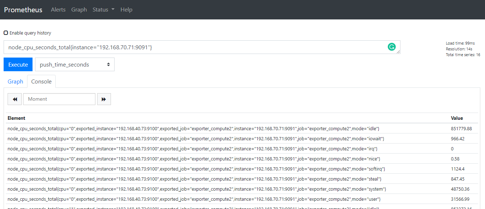
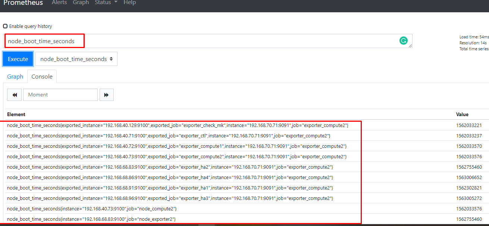
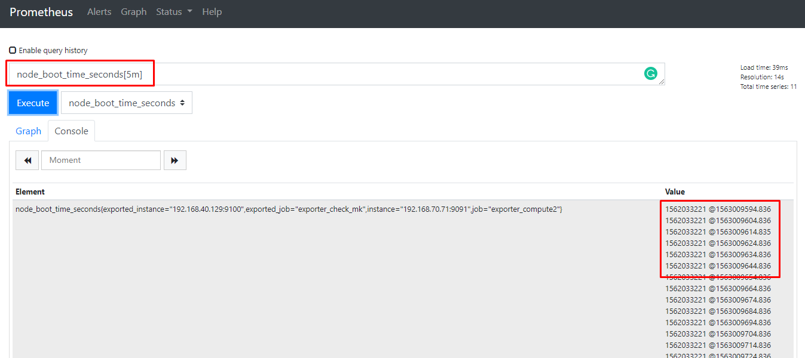
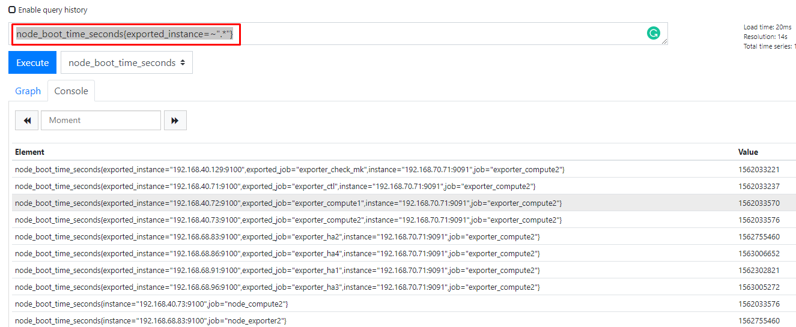
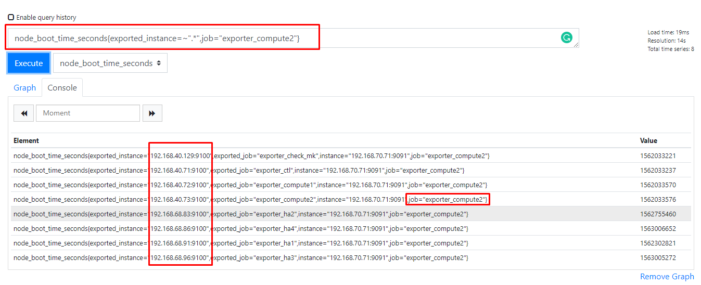
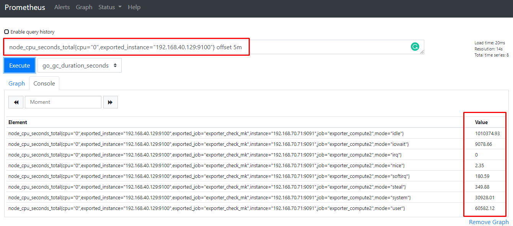
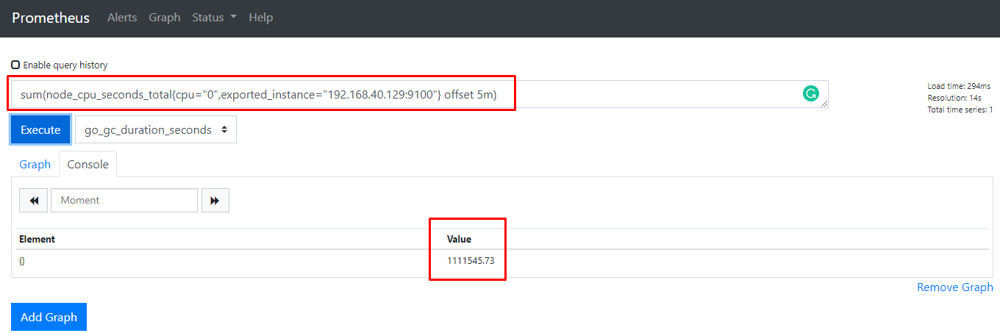
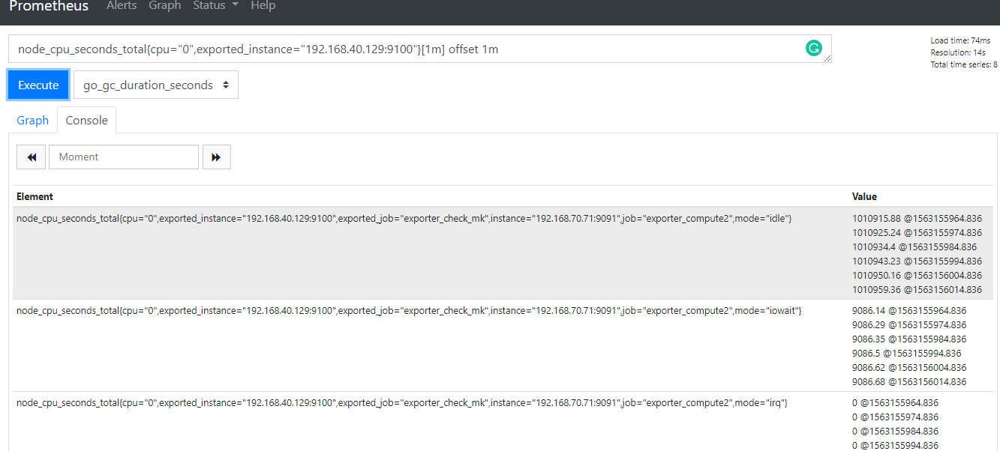
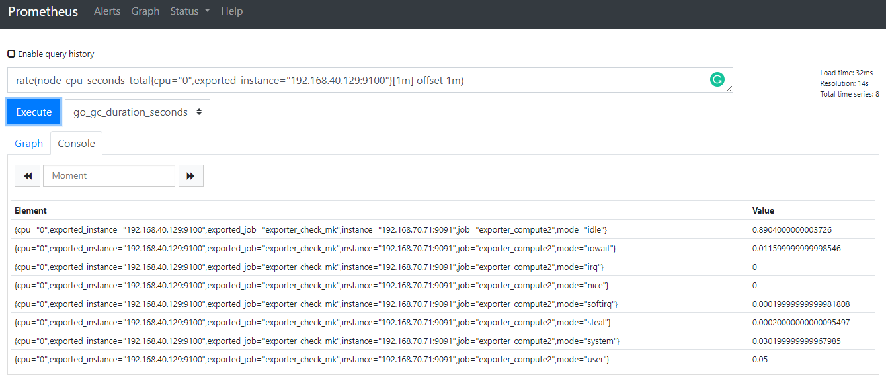

# Querying Prometheus

## 1. Basic

Prometheus cung cấp một ngôn ngữ truy vấn được gọi là PromQL (Prometheus Query Language) cho phép các user select và aggrerate time series data trong thời gian thực. Kết quả của của một biểu thức chính quy có thể trình bày như một biểu đồ, được xem như tabular data (dữ liệu bảng) trong Prometheus's expression browser hoặc dược consumed bởi một ứng dụng khác ngoài hệ thống thông qua API.

Ví dụ: Thực hiện truy vấn `node_cpu_seconds_total{instance="192.168.70.71:9091"}` để hiển thị tất cả các metric `node_cpu_seconds_total` có lable là `instance="192.168.70.71:9091"`




### 1.1 Expression language data types

Trong expression language của Prometheus, một expression hoặc sub-expression có thể là một trong 4 kiểu sau:

* **Instant vector** là một chuỗi các single sample của time series có cùng timestamp



* **Range vector** Một chuỗi của time series gồm một loạt các data points theo thời gian 



* **Scalar**: Một giá trị numeric floating point đơn giản

* **String**: giá trị string đơn giản, hiện tại đã không còn sử dụng


### 1.2 Literals

#### String literals

Strings cũng có thể được chỉ định như một từ trong cặp dấu ngoặc đơn ('), ngoặc đôi(") hoặc dấu backticks (\`).

PromQL có các quy tắc giống như [Go](https://golang.org/ref/spec#String_literals). Trong dấu ngoặc đơn hoặc ngoặc đôi, dấu `\` để bắt đầu ngắt chuỗi, theo sau nó có thể là `a`, `b`, `f`, `n`, `r`, `t`, `v` hoặc `\`.

Trong dấu backticks (\`) không có xử lý escaping (ký từ ngắt chuỗi), Không giống như Go, Prometheus không loại bỏ các dòng mới bên trong backticks.

Ví dụ:

```sh
"this is a string"
'these are unescaped: \n \\ \t'
`these are not unescaped: \n ' " \t`
```

#### Float literals

Giá trị Scalar float có thể được viết như các chữ số `[-](digits)[.(digits)]`

Ví dụ:

```sh
-2.43
```


### 1.3 Time series Selectors

#### Instant vector selectors

Instant vector selectors cho phép chọn một chuỗi time series và một giá trị single sample cho mỗi timestamp (instant): dạng đơn gian nhất là chỉ có một metric name được chỉ định. Điều này dẫn đến một instant vector chứa các phần tử cho tất cả các time selectors có metric name này.

Ví dụ lựa chọn tất cả các Time series có metric name là `http_requests_total`

```sh
http_requests_total
```

Nó có thể tiếp tục filter theo các nhãn của nó bằng cách khớp với các nhãn trong cặp dấu ngoặc nhọn `{}`

```sh
http_requests_total{job="prometheus",group="canary"}
```

Cũng có thể dùng thêm một số các ký hiệu khác để thể hiện match hoặc không match với các label value:

* `=`: Select labels that are exactly equal to the provided string.
* `!=`: Select labels that are not equal to the provided string.
* `=~`: Select labels that regex-match the provided string.
* `!~`: Select labels that do not regex-match the provided string. 

Ví dụ, query tất các `http_requests_total` time series với staging, testing, and development environments và HTTP methods khác với `GET`

```sh
http_requests_total{environment=~"staging|testing|development",method!="GET"}
```

Lablel matchers khớp với các label values cũng sẽ chọn tất cả các time series không có một bộ label cụ thể nào. Sử dụng regex-matches, nó có thể sẽ match với nhiều các lable name khác nhau.

Ví dụ: 
* Thực hiện query tất cả các `exported_instance` có nhãn bất kỳ

```sh
node_boot_time_seconds{exported_instance=~".*"}
```





#### Range Vector Selectors

Thời lượng được chỉ định là một số được biểu diễn trong `[]`, theo sau đó có thể là một trong số các đơn vị sau:

* s - seconds
* m - minutes
* h - hours
* d - days
* w - weeks
* y - years

Ví dụ, chọn tất cả các giá trị trong 5 phút gần nhất có metric name là `http_requests_total`

```sh
http_requests_total{job="prometheus"}[5m]
```

#### Offset modifier

`offset` modifier cho phép thay đổi time offset cho các individual instant và range vectors trong một query.

Ví dụ, expression dưới đây trả về giá trị của `http_requests_total` 5 phút trước so với thời gian truy vấn hiện tại.

```sh
http_requests_total offset 5m
```

Chú ý rằng `offset` modifier luôn luôn cần những selectors theo ngay sau đó, ví dụ:

```sh
sum(http_requests_total{method="GET"} offset 5m) // GOOD.
sum(http_requests_total{method="GET"}) offset 5m // INVALID.
```

Thực hành:





Tương tự với range vectors. Ví dụ dưới đây trả về tỉ lệ trong 5 phút của `http_requests_total` trong một tuần trước:

```sh
rate(http_requests_total[5m] offset 1w)
```

Thực hành:





### 1.4 Subquery

Subquery cho phép bạn chạy một instant query cho một range và resolution. Kết quả của một subquery là một range vector.

Syntax: 

```sh
<instant_query> '[' <range> ':' [<resolution>] ']' [ offset <duration> ]
```

* Trong đó: `<resolution>` có thể có hoặc không. Mặc định thì sẽ sử dụng global interval.

### 1.5 Operators

Prometheus cho phép nhiều binary và aggreration operators. Nó được miêu tả chi tiết trong [expression language operators](https://prometheus.io/docs/prometheus/latest/querying/operators/) page.

### 1.6 Functions

Prometheus hỗ trợ một số các functions để operate on data. Nó đưuọc miêu tả chi tiết tại [expression language functions](https://prometheus.io/docs/prometheus/latest/querying/functions/) page.

## 2. Operators

### 2.1 Binary operators

#### Arithmetic binary operators

Prometheus hỗ trợ một số các binary arithmetic operators dưới đây:

* `+` (addition)
* `-` (subtraction)
* `*` (multiplication)
* `/` (division)
* `%` (modulo)
* `^` (power/exponentiation)

Binary arithmetic operators được định nghĩa giữa cặp giá trị scalar/scalar, vector/scalar, and vector/vector.

* **Between two scalars** là điều hiển nhiên như các phép toán bình thường

* **Between an instant vector and a scalar**, operator được áp dụng cho mỗi giá trị data sample trong vector với scalar

* **Between two instant vectors** một binary arithmetic operator được áp dụng cho mỗi entry trong vector bên trái và nó matching element với vector phía bên phải. Kết quả là một vector với grouping labels trở thành output label set. Metric name sẽ bị loại bỏ. Entries không match với entry trong right-hand vector thì sẽ không được tìm thấy trong result.

#### Comparison binary operators

Prometheus hỗ trợ binary comparison operators sau:

* `==` (equal)
* `!=` (not-equal)
* `>`(greater-than)
* `<`(less-than)
* `>=` (greater-or-equal)
* `<=` (less-or-equal)

#### Logical/set binary operators

Các logical/set binary operators được định nghĩa chỉ dùng giữa các instant vector:

* `and` (intersection)
* `or` (union)
* `unless` (complement)

### 2.2 Aggregation operators

Prometheus hỗ trợ built-in aggregation operators sử dụng để aggregation các phần tử của một single instant vector, kết quả trong sẽ nằm trong một vector mới ít các phần tử hơn với các giá trị được aggregated:

* `sum` (calculate sum over dimensions)
* `min` (select minimum over dimensions)
* `max` (select maximum over dimensions)
* `avg` (calculate the average over dimensions)
* `stddev` (calculate population standard deviation over dimensions)
* `stdvar` (calculate population standard variance over dimensions)
* `count` (count number of elements in the vector)
* `count_values` (count number of elements with the same value)
* `bottomk` (smallest k elements by sample value)
* `topk` (largest k elements by sample value)
* `quantile` (calculate φ-quantile (0 ≤ φ ≤ 1) over dimensions)

Syntax:

```sh
<aggr-op>([parameter,] <vector expression>) [without|by (<label list>)]
```

Ví dụ:

* Nếu metric `http_requests_total` có time series với các labels là `application`, `instance` và `group`, chún ta sẽ tính tổng số các HTTP requests cho mỗi application và group cho tất cả các instance:

```sh
sum(http_requests_total) without (instance)
```

* Hoặc có thể viết như sau:

```sh
sum(http_requests_total) by (application, group)
```

* Nếu muốn tính tổng tất cả các request của HTTP gửi cho tất cả các app thì có thể viết đơn giản như sau:

```sh
sum(http_requests_total)
```

* Để đếm số binaries đang chạy cho mỗi build version có thể viết như sau:

```sh
count_values("version", build_version)
```

* Để lấy 5 request HTTP lớn nhất được tính trong tất cả các instance:

```sh
topk(5, http_requests_total)
```

### 2.3 Binary operator precedence

Dưới đây là danh sách precedence of binary operators trong Prometheus với độ ưu tiên từ cao tới thấp

1. ^
2. *, /, %
3. +, -
4. ==, !=, <=, <, >=, >
5. and, unless
6. or

Các Operators có cùng mức độ ưu tiên sẽ thực hiện lần lượt từ trái qua phải. Ví dụ với biểu thức `2 * 3 % 2` sẽ tương đương như `(2 * 3) % 2`. Tuy nhiên với `^` thì sẽ thực hiện từ phải qua, ví dụ `2 ^ 3 ^ 2` sẽ tương đương với `2 ^ (3 ^ 2)`.


## Tham khảo

[1] https://prometheus.io/docs/prometheus/latest/querying/basics/

