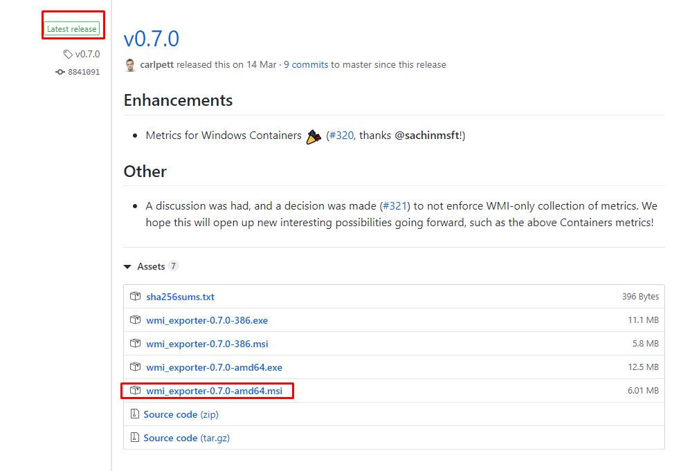
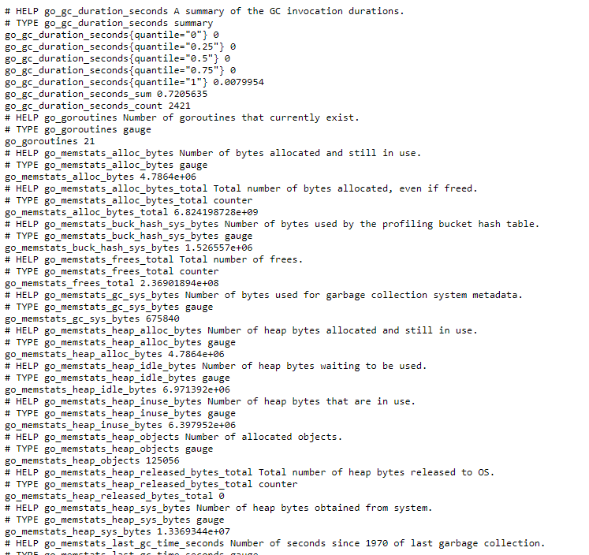
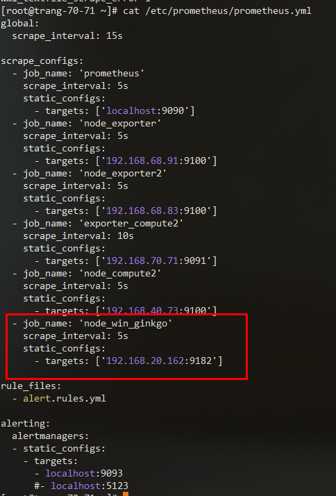
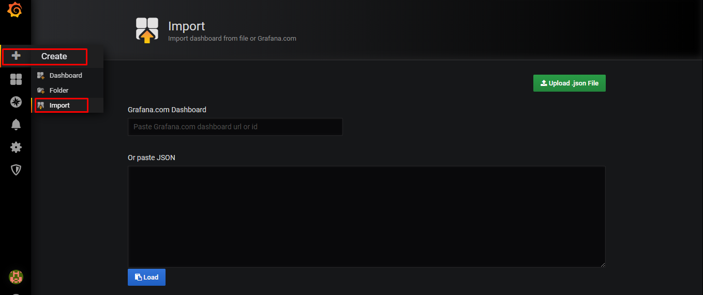
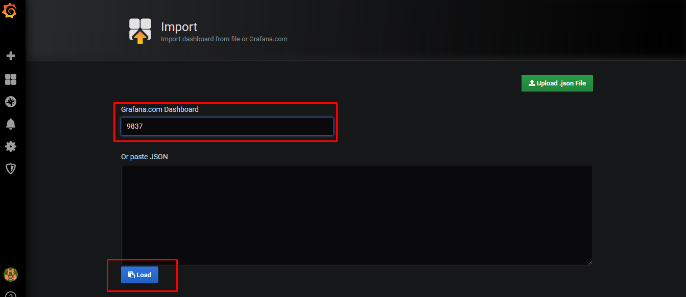
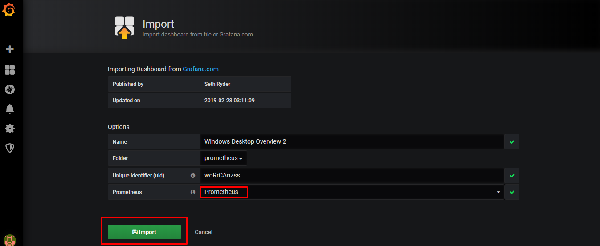
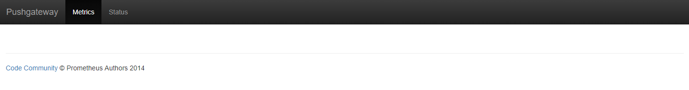
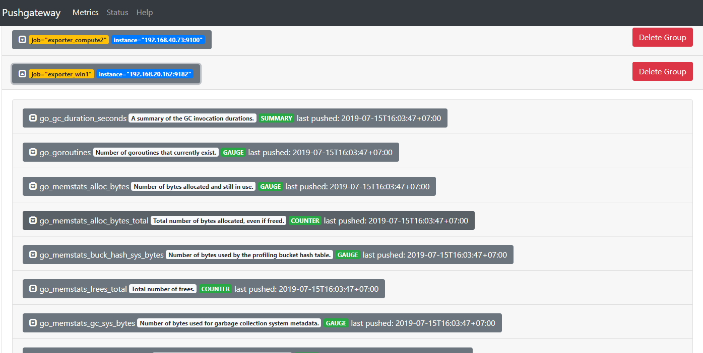
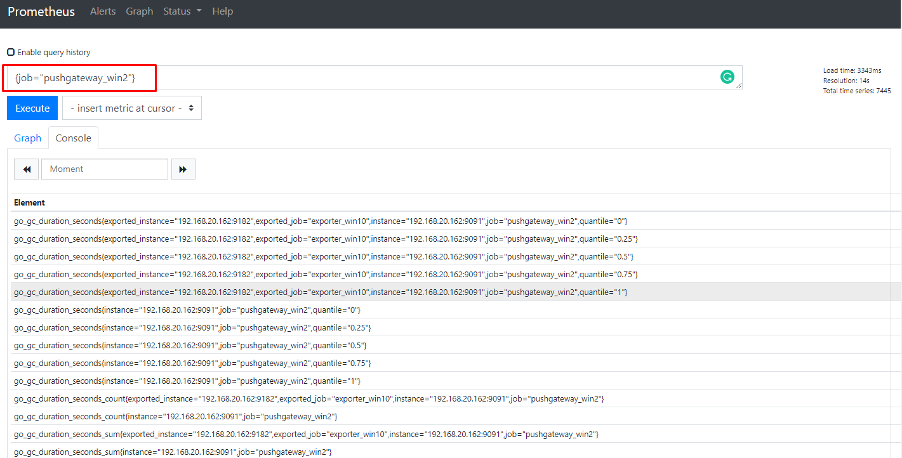

## Cấu hình Prometheus trên Windows 

Chuẩn bị một máy Windows với các thông tin cần thiết sau:

* IP: 192.168.20.162/24
* Firewall mở port 9182 theo cả chiều in và out

### 1. Thực hiện cấu hình trên node Windows

Thực hiện download phiên bản mới nhất tại https://github.com/martinlindhe/wmi_exporter/releases



Chạy file cài đặt được tải về, sau đó thực hiện truy cập vào trang web http://192.168.20.162:9182/metrics



Sau khi cài đặt như trên sẽ chỉ lấy được một số các thông số mặc định như os, cpu,... nếu muốn lây thêm một số các thông số khác có thể thực hiện như sau:

* Tải file `wmi_exporter-0.4.3-amd64.msi` (hiện tại đang là bản mới nhất) về đặt tại thư mục `C:\`, sau đó mở powershell với quyền Admin và gõ lệnh như sau:

```sh
PS C:\> msiexec /i C:\wmi_exporter-0.4.3-amd64.msi ENABLED_COLLECTORS=os,cpu,cs,hyperv,logical_disk,memory,net,process,service,system,tcp,textfile,vmware
```


### 2. Cấu hình pull metric từ prometheus server 

Thêm vào file cấu hình của prometheus những dòng như sau:

```sh
  - job_name: 'node_win_ginkgo'
    scrape_interval: 5s
    static_configs:
      - targets: ['192.168.20.162:9182']
```

Ví dụ một file cấu hình hoàn chỉnh của tôi



Khởi động lại dịch vụ:

```sh
sudo systemctl restart prometheus
```

### 3. Thêm dashboard trên grafana

Thêm dashboard https://grafana.com/dashboards/9837

* Import dashboard



* Nhập ID của dashboad



* Chọn datasource rồi import dashboard



* Kết quả


Tham khảo dashboard mẫu [tại đây](https://home.sethryder.com/grafana/d/woRrCAriz/windows-overview?orgId=1&from=now-1h&to=now&refresh=30s)

### 4. Thực hiện push metric từ windows node lên pushgateway

#### Cài đặt một pushgatway trên windows (tải từ trang chủ và cài đặt)

Hiện tại tôi mới chỉ làm với file .exe, chạy trực tiếp, chưa tích hợp chạy cùng hệ thống 


Mở firewall cho port 9091 theo cả chiều IN và OUT

Sau khi chạy file `.exe` xong, kiểm tra trên web pushgateway với địa chỉ ip của windows: http://192.168.20.162:9091/



#### Tạo một script để đẩy metric từ các node windows tới pushgateway

Tạo một script để get metric về và đẩy lên pushgateway, tạm thời việc này được thực hiện trên một node Linux (làm tương tự với việc đẩy metric từ các node exporter linux)

Kiểm tra trên web của pushgatewway xem đã có metric đẩy về chưa http://192.168.70.71:9091/



#### Cấu hình Prometheus

Chỉnh sửa file `/etc/prometheus/prometheus.yml`

```sh
  - job_name: 'pushgateway_win2'
    scrape_interval: 10s
    static_configs:
      - targets: ['192.168.20.162:9091']
```

Kiểm tra trên web của prometheus: http://192.168.70.71:9090/graph




https://medium.com/@facundofarias/setting-up-a-prometheus-exporter-on-windows-b3e45f1235a5

https://github.com/martinlindhe/wmi_exporter
