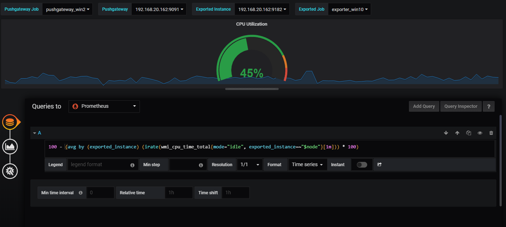
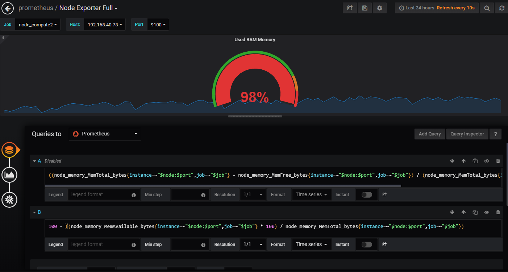

# HTTP API

HTTP API ổn định hiện tại có thể truy cập dưới dạng `/api/v1` trên Prometheus server. Bất kỳ một non-breaking additions nào sẽ được thêm vào dưới endpoint.

## 1. Format overview

Định dạng API response là JSON. Mỗi một API request thành công sẽ trả về mã 2xx status code.

Invalid request tiếp cận tới API handers sẽ trả về một chuỗi JSON error object và một trong số các HTTP response codes sau:

* `400` Bad Request when parameters are missing or incorrect.
* `422` Unprocessable Entity when an expression can't be executed (RFC4918).
* `503` Service Unavailable when queries time out or abort.

Một mã code non-2xx có thể được trả về khi xảy ra lỗi trước khi tiếp cận được tới API endpoint.

Tất cả các data được collected thành công sẽ trả về trong trường data field.

Định dạng JSON response envelope như sau:

```sh
{
  "status": "success" | "error",
  "data": <data>,

  // Only set if status is "error". The data field may still hold
  // additional data.
  "errorType": "<string>",
  "error": "<string>",

  // Only if there were warnings while executing the request.
  // There will still be data in the data field.
  "warnings": ["<string>"]
}
```

Input timestamps có thể được cung cấp trong [RFC3339](https://www.ietf.org/rfc/rfc3339.txt) hoặc tương tự với Unix timestamp tính bằng giây, với số lượng số thập phân tùy ý với độ chính xác của sub-second. Output timestamps sẽ luôn được biểu diễn bằng Unix timestamps tính bằng giây.

Names of query parameters có thể kết thúc việc lặp lại với `[]`

`<series_selector>` placeholders refer to Prometheus [time series selectors](https://prometheus.io/docs/prometheus/latest/querying/basics/#time-series-selectors) like `http_requests_total` or `http_requests_total{method=~"(GET|POST)"}` and need to be URL-encoded.

`<duration>` placeholders refer to Prometheus duration strings of the form `[0-9]+[smhdwy]`. For example, 5m refers to a duration of 5 minutes.

`<bool>` placeholders refer to boolean values (strings true and false).


## 2. Expression queries

Query language expressions có thể được đánh giá bởi một single instant hoặc một khoảng thời gian nhất định.

### Instant queries

Endpoint dưới đây đánh gia một truy vấn tức thời (instant query) tại một thời điểm duy nhất (single point in time).

```sh
GET /api/v1/query
POST /api/v1/query
```

URL query parameters:

* `query=<string>`: Prometheus expression query string.
* `time=<rfc3339 | unix_timestamp>`: Evaluation timestamp. Optional.
* `timeout=<duration>`: Evaluation timeout. Optional. Defaults to and is capped by the value of the -query.timeout flag.

Current server time được sử dụng nếu tham số `time` bị bỏ qua.

Bạn có thể mã hóa các URL có các tham số directly trong request body bằng cách sử dụng POST method và `Content-Type:application/x-www-form-urlencoded` header. 

`data` section của kết quả query sẽ có định dạng như sau:

```sh
{
  "resultType": "matrix" | "vector" | "scalar" | "string",
  "result": <value>
}
```

`<value>` là query result data, định dạng của nó phụ thuộc vào `resultType`, sẽ đề cập tới rõ hơn trong phần **expression query result formats** ở phía dưới đây.

Dưới đây là một ví dụ expression `up` vào lúc 2015-07-01T20:10:51.781Z:

```sh
$ curl 'http://localhost:9090/api/v1/query?query=up&time=2015-07-01T20:10:51.781Z'
{
   "status" : "success",
   "data" : {
      "resultType" : "vector",
      "result" : [
         {
            "metric" : {
               "__name__" : "up",
               "job" : "prometheus",
               "instance" : "localhost:9090"
            },
            "value": [ 1435781451.781, "1" ]
         },
         {
            "metric" : {
               "__name__" : "up",
               "job" : "node",
               "instance" : "localhost:9100"
            },
            "value" : [ 1435781451.781, "0" ]
         }
      ]
   }
}
```

### Range queries

Endpoint dưới đây mô phỏng một expression query trong một khoảng thời gian nhất đinh:

```sh
GET /api/v1/query_range
POST /api/v1/query_range
```

URL query parameters:

* `query=<string>`: Prometheus expression query string.
* `start=<rfc3339 | unix_timestamp>`: Start timestamp.
* `end=<rfc3339 | unix_timestamp>`: End timestamp.
* `step=<duration | float>`: Query resolution step width in duration format or float number of seconds.
* `timeout=<duration>`: Evaluation timeout. Optional. Defaults to and is capped by the value of the -query.timeout flag.


`data` section của query result có định dạng như sau:

```sh
{
  "resultType": "matrix",
  "result": <value>
}
```

Định dạng của `<value>` sẽ được viết chi tiết ở phần dưới.

Dưới đâu là ví dụ expression `up` trong khoảng thời gian 30s với query resolution là 15s:

```sh
curl 'http://localhost:9090/api/v1/query_range?query=up&start=2015-07-01T20:10:30.781Z&end=2015-07-01T20:11:00.781Z&step=15s'
{
   "status" : "success",
   "data" : {
      "resultType" : "matrix",
      "result" : [
         {
            "metric" : {
               "__name__" : "up",
               "job" : "prometheus",
               "instance" : "localhost:9090"
            },
            "values" : [
               [ 1435781430.781, "1" ],
               [ 1435781445.781, "1" ],
               [ 1435781460.781, "1" ]
            ]
         },
         {
            "metric" : {
               "__name__" : "up",
               "job" : "node",
               "instance" : "localhost:9091"
            },
            "values" : [
               [ 1435781430.781, "0" ],
               [ 1435781445.781, "0" ],
               [ 1435781460.781, "1" ]
            ]
         }
      ]
   }
}
```


Một ví dụ query trên grafana



Thực hiện tương tự với lệnh sau để tương tác với API

```sh
$ curl 'http://192.168.70.71:9090/api/v1/query_range?query=100%20-%20(avg%20by%20(exported_instance)%20(irate(wmi_cpu_time_total%7Bmode%3D%22idle%22%2C%20exported_instance%3D~%22192.168.20.162%3A9182%22%7D%5B1m%5D))%20*%20100)&start=1563509880&end=1563520680&step=120' | jq -r '.'
{
  "status": "success",
  "data": {
    "resultType": "matrix",
    "result": [
      {
        "metric": {
          "exported_instance": "192.168.20.162:9182"
        },
        "values": [
          [
            1563509880,
            "48.331736625002584"
          ],
          [
            1563510000,
            "23.228182999999945"
          ],
          [
            1563510120,
            "27.871328624999023"
          ],
        ...
```

Ví dụ khác, query memory usage:




```sh
$ curl 'http://192.168.70.71:9090/api/v1/query_range?query=100%20-%20((node_memory_MemAvailable_bytes%7Binstance%3D~%22192.168.40.73%3A9100%22%2Cjob%3D~%22node_compute2%22%7D%20*%20100)%20%2F%20node_memory_MemTotal_bytes%7Binstance%3D~%22192.168.40.73%3A9100%22%2Cjob%3D~%22node_compute2%22%7D)&start=1563434100&end=1563520500&step=900' | jq -r '.'
{
  "status": "success",
  "data": {
    "resultType": "matrix",
    "result": [
      {
        "metric": {
          "instance": "192.168.40.73:9100",
          "job": "node_compute2"
        },
        "values": [
          [
            1563434100,
            "97.35128281776669"
          ],
          [
            1563435000,
            "97.48054384463939"
          ],
          [
            1563435900,
            "97.34365497407563"
          ],
          [
            1563436800,
            "97.48569779307928"
          ],
        ...
```

## 3. Querying metadata

### Finding series by label matchers

Enpoint dưới đây trả về danh sách của một time series match với một certain label set

```sh
GET /api/v1/series
POST /api/v1/series
```

URL query parameters:

* `match[]=<series_selector>`: Repeated series selector argument that selects the series to return. At least one match[] argument must be provided.
* `start=<rfc3339 | unix_timestamp>`: Start timestamp.
* `end=<rfc3339 | unix_timestamp>`: End timestamp.

<data> section trong kết quả trả về khi query là tập một list các objects gồm lable name/value pairs, cái mà định danh cho mỗi series.

Ví dụ dưới đây trả về tất cả các series match với selectors `up` hoặc `process_start_time_seconds{job="prometheus"}`:

```sh
$ curl -g 'http://localhost:9090/api/v1/series?' --data-urlencode='match[]=up' --data-urlencode='match[]=process_start_time_seconds{job="prometheus"}'
{
   "status" : "success",
   "data" : [
      {
         "__name__" : "up",
         "job" : "prometheus",
         "instance" : "localhost:9090"
      },
      {
         "__name__" : "up",
         "job" : "node",
         "instance" : "localhost:9091"
      },
      {
         "__name__" : "process_start_time_seconds",
         "job" : "prometheus",
         "instance" : "localhost:9090"
      }
   ]
}
```

### Getting label names

Các endpoint dưới đây trả về danh sách của label name:

```sh
GET /api/v1/labels
POST /api/v1/labels
```

`<data>` section là một danh sách chuỗi các label name.

Ví dụ:

```sh
$ curl 'localhost:9090/api/v1/labels'
{
    "status": "success",
    "data": [
        "__name__",
        "call",
        "code",
        "config",
        "dialer_name",
        "endpoint",
        "event",
        "goversion",
        "handler",
        "instance",
        "interval",
        "job",
        "le",
        "listener_name",
        "name",
        "quantile",
        "reason",
        "role",
        "scrape_job",
        "slice",
        "version"
    ]
}
```

### Querying label values

Endpoint dưới đây trả về một danh sách label values của một label name được cung cấp

```sh
GET /api/v1/label/<label_name>/values
```

`<data>` section cuar JSON response là một danh sách chuỗi các label values.

Ví dụ một cho việc query label values của label `job`, hai là query label values của label `instance`:

```sh
[root@trang-70-71 ~]# curl http://localhost:9090/api/v1/label/job/values | jq -r '.';
{
  "status": "success",
  "data": [
    "exporter_compute2",
    "node_compute2",
    "node_exporter",
    "node_exporter2",
    "node_win_ginkgo",
    "prometheus",
    "push_gateway",
    "pushgateway_win",
    "pushgateway_win2"
  ]
}

[root@trang-70-71 ~]# curl http://localhost:9090/api/v1/label/instance/values | jq -r '.';
{
  "status": "success",
  "data": [
    "192.168.20.162:9091",
    "192.168.20.162:9182",
    "192.168.40.123:9091",
    "192.168.40.73:9100",
    "192.168.68.83:9100",
    "192.168.68.91:9100",
    "192.168.70.71:9091",
    "localhost:9090"
  ]
}
```

## 4. Expression query result formats

Expression queries có thể trả về response values trong `result` property của `data` section. `<sample_value>` placeholders là numeric sample values. 

### Range vectors

Range vectors là result kiểu `matrix`. Định dạng của `result` chung như sau:

```sh
[
  {
    "metric": { "<label_name>": "<label_value>", ... },
    "values": [ [ <unix_time>, "<sample_value>" ], ... ]
  },
  ...
]
```

### Instant vectors

Instant vectors are returned as result type `vector`. Nó có định dạng như sau:

```sh
[
  {
    "metric": { "<label_name>": "<label_value>", ... },
    "value": [ <unix_time>, "<sample_value>" ]
  },
  ...
]
```

### Scalars

Scalar results are returned as result type `scalar`. Định dạng:

```sh
[ <unix_time>, "<scalar_value>" ]
```

### Strings

String results are returned as result type `string`

```sh
[ <unix_time>, "<string_value>" ]
```


## 5. Targets

Endpoint dưới đây trả về kết quả là tổng quan về current state của Prometheus targets discovery:

```sh
GET /api/v1/targets
```

Cả active and dropped targets đều là một phần của response. `labels` đại diện label đã được set sau khi relabelling đã xảy ra. `discoveredLabels` đại diện cho các unmodified labels được phục hồi trong khi các service discovery trước khi relabelling xảy ra.

```sh
[root@trang-70-71 ~]# curl http://localhost:9090/api/v1/targets | jq -r '.'
  % Total    % Received % Xferd  Average Speed   Time    Time     Time  Current
                                 Dload  Upload   Total   Spent    Left  Speed
100  2336    0  2336    0     0   376k      0 --:--:-- --:--:-- --:--:--  456k
{
  "status": "success",
  "data": {
    "activeTargets": [
      {
        "discoveredLabels": {
          "__address__": "192.168.70.71:9091",
          "__metrics_path__": "/metrics",
          "__scheme__": "http",
          "job": "exporter_compute2"
        },
        "labels": {
          "instance": "192.168.70.71:9091",
          "job": "exporter_compute2"
        },
        "scrapeUrl": "http://192.168.70.71:9091/metrics",
        "lastError": "",
        "lastScrape": "2019-07-19T16:41:24.836028571+07:00",
        "health": "up"
      },
      {
        "discoveredLabels": {
          "__address__": "192.168.40.73:9100",
          "__metrics_path__": "/metrics",
          "__scheme__": "http",
          "job": "node_compute2"
        },
        "labels": {
          "instance": "192.168.40.73:9100",
          "job": "node_compute2"
        },
        "scrapeUrl": "http://192.168.40.73:9100/metrics",
        "lastError": "",
        "lastScrape": "2019-07-19T16:41:31.765283854+07:00",
        "health": "up"
      },
      {
        "discoveredLabels": {
          "__address__": "192.168.68.91:9100",
          "__metrics_path__": "/metrics",
          "__scheme__": "http",
          "job": "node_exporter"
        },
        "labels": {
          "instance": "192.168.68.91:9100",
          "job": "node_exporter"
        },
        "scrapeUrl": "http://192.168.68.91:9100/metrics",
        "lastError": "",
        "lastScrape": "2019-07-19T16:41:34.593115451+07:00",
        "health": "up"
      },
    ...
```

## 6. Rules

`/rules` API endpoint trả về một danh sách các alerting và recording rules hiện tại đang được load. Thêm nữa, nó sẽ trả về các alerts đang được kích hoạt bởi Prometheus instance của mỗi alerting rule.

```sh
GET /api/v1/rules
```

```sh
$ curl http://localhost:9090/api/v1/rules

{
    "data": {
        "groups": [
            {
                "rules": [
                    {
                        "alerts": [
                            {
                                "activeAt": "2018-07-04T20:27:12.60602144+02:00",
                                "annotations": {
                                    "summary": "High request latency"
                                },
                                "labels": {
                                    "alertname": "HighRequestLatency",
                                    "severity": "page"
                                },
                                "state": "firing",
                                "value": "1e+00"
                            }
                        ],
                        "annotations": {
                            "summary": "High request latency"
                        },
                        "duration": 600,
                        "health": "ok",
                        "labels": {
                            "severity": "page"
                        },
                        "name": "HighRequestLatency",
                        "query": "job:request_latency_seconds:mean5m{job=\"myjob\"} > 0.5",
                        "type": "alerting"
                    },
                    {
                        "health": "ok",
                        "name": "job:http_inprogress_requests:sum",
                        "query": "sum(http_inprogress_requests) by (job)",
                        "type": "recording"
                    }
                ],
                "file": "/rules.yaml",
                "interval": 60,
                "name": "example"
            }
        ]
    },
    "status": "success"
}
```

Một ví dụ khác về cảnh báo các instance down trong 1h

```sh
[root@trang-70-71 ~]# curl http://localhost:9090/api/v1/rules | jq -r '.'
{
  "status": "success",
  "data": {
    "groups": [
      {
        "name": "Instances",
        "file": "/etc/prometheus/alert.rules.yml",
        "rules": [
          {
            "name": "InstanceDown",
            "query": "up == 0",
            "duration": 3600,
            "labels": {
              "severity": "page"
            },
            "annotations": {
              "description": "{{ .instance }} of job {{ .job }} has been down for more than 10 s.",
              "summary": "Instance {{ .instance }} down"
            },
            "alerts": [],
            "health": "ok",
            "type": "alerting"
          }
        ],
        "interval": 60
      }
    ]
  }
}
```

## 7. Alert

```sh
GET /api/v1/alerts
```

Ví dụ:

```sh
$ curl http://localhost:9090/api/v1/alerts

{
    "data": {
        "alerts": [
            {
                "activeAt": "2018-07-04T20:27:12.60602144+02:00",
                "annotations": {},
                "labels": {
                    "alertname": "my-alert"
                },
                "state": "firing",
                "value": "1e+00"
            }
        ]
    },
    "status": "success"
}
```

## 8. Querying target metadata

Endpoint dưới đây trả về metadata của metric hiện tại được scraped bởi targets. Đây chỉ là tính năng thử nghiệm và có thể thay đổi trong tương lai.

```sh
GET /api/v1/targets/metadata
```

URL query parameters:

* match_target=<label_selectors>: Label selectors that match targets by their label sets. All targets are selected if left empty.
* metric=<string>: A metric name to retrieve metadata for. All metric metadata is retrieved if left empty.
* limit=<number>: Maximum number of targets to match.

`<data>` section của query result bao gồm một danh sách các objects chứa metric metadata và target label set.

Ví dụ dưới đây trả về tất cả các metadata của metric `go_goroutines` từ hai target với label `job="prometheus"`.


```sh
curl -G http://localhost:9091/api/v1/targets/metadata \
    --data-urlencode 'metric=go_goroutines' \
    --data-urlencode 'match_target={job="prometheus"}' \
    --data-urlencode 'limit=2'
{
  "status": "success",
  "data": [
    {
      "target": {
        "instance": "127.0.0.1:9090",
        "job": "prometheus"
      },
      "type": "gauge",
      "help": "Number of goroutines that currently exist.",
      "unit": ""
    },
    {
      "target": {
        "instance": "127.0.0.1:9091",
        "job": "prometheus"
      },
      "type": "gauge",
      "help": "Number of goroutines that currently exist.",
      "unit": ""
    }
  ]
}
```

Ví dụ dưới đây trả về metadata của tất cả các metric cho tất cả các targets với label là `instance="127.0.0.1:9090`

```sh
curl -G http://localhost:9091/api/v1/targets/metadata \
    --data-urlencode 'match_target={instance="127.0.0.1:9090"}'
{
  "status": "success",
  "data": [
    // ...
    {
      "target": {
        "instance": "127.0.0.1:9090",
        "job": "prometheus"
      },
      "metric": "prometheus_treecache_zookeeper_failures_total",
      "type": "counter",
      "help": "The total number of ZooKeeper failures.",
      "unit": ""
    },
    {
      "target": {
        "instance": "127.0.0.1:9090",
        "job": "prometheus"
      },
      "metric": "prometheus_tsdb_reloads_total",
      "type": "counter",
      "help": "Number of times the database reloaded block data from disk.",
      "unit": ""
    },
    // ...
  ]
}
```

Ví dụ khác:

```sh
[root@trang-70-71 ~]# curl -G http://192.168.70.71:9090/api/v1/targets/metadata --data-urlencode 'metric=go_goroutines' --data-urlencode 'match_target={job="node_compute2"}' --data-urlencode 'limit=2'  | jq -r '.'
{
  "status": "success",
  "data": [
    {
      "target": {
        "instance": "192.168.40.73:9100",
        "job": "node_compute2"
      },
      "type": "gauge",
      "help": "Number of goroutines that currently exist.",
      "unit": ""
    }
  ]
}
```

## 9. Alertmanagers

```sh
GET /api/v1/alertmanagers
```

```sh
$ curl http://localhost:9090/api/v1/alertmanagers
{
  "status": "success",
  "data": {
    "activeAlertmanagers": [
      {
        "url": "http://127.0.0.1:9090/api/v1/alerts"
      }
    ],
    "droppedAlertmanagers": [
      {
        "url": "http://127.0.0.1:9093/api/v1/alerts"
      }
    ]
  }
}
```

## 10. Status

### Config 

Endpoint này hiện thị trạng thái hiện tại các cấu hình của Prometheus

```sh
GET /api/v1/status/config
```

Cấu hình được trả về như dumped YAML file. Do sự giới hạn của YAML library, nên các YAML comments sẽ không bao gồm ở đây

```sh
$ curl http://localhost:9090/api/v1/status/config
{
  "status": "success",
  "data": {
    "yaml": "<content of the loaded config file in YAML>",
  }
}
```

### Flags

```sh
GET /api/v1/status/flags
```

Xem các cờ đang được bật

```sh
[root@trang-70-71 ~]# curl http://192.168.70.71:9090/api/v1/status/flags  |jq -r '.'
  % Total    % Received % Xferd  Average Speed   Time    Time     Time  Current
                                 Dload  Upload   Total   Spent    Left  Speed
100  1328  100  1328    0     0   846k      0 --:--:-- --:--:-- --:--:-- 1296k
{
  "status": "success",
  "data": {
    "alertmanager.notification-queue-capacity": "10000",
    "alertmanager.timeout": "10s",
    "config.file": "/etc/prometheus/prometheus.yml",
    "log.format": "logfmt",
    "log.level": "info",
    "query.lookback-delta": "5m",
    "query.max-concurrency": "20",
    "query.max-samples": "50000000",
    "query.timeout": "2m",
    "rules.alert.for-grace-period": "10m",
    "rules.alert.for-outage-tolerance": "1h",
    "rules.alert.resend-delay": "1m",
    "storage.remote.flush-deadline": "1m",
    "storage.remote.read-concurrent-limit": "10",
    "storage.remote.read-sample-limit": "50000000",
    "storage.tsdb.allow-overlapping-blocks": "false",
    "storage.tsdb.max-block-duration": "36h",
    "storage.tsdb.min-block-duration": "2h",
    "storage.tsdb.no-lockfile": "false",
    "storage.tsdb.path": "/var/lib/prometheus/",
    "storage.tsdb.retention": "0s",
    "storage.tsdb.retention.size": "0B",
    "storage.tsdb.retention.time": "0s",
    "storage.tsdb.wal-segment-size": "0B",
    "web.console.libraries": "/etc/prometheus/console_libraries",
    "web.console.templates": "/etc/prometheus/consoles",
    "web.cors.origin": ".*",
    "web.enable-admin-api": "true",
    "web.enable-lifecycle": "false",
    "web.external-url": "http://192.168.70.71",
    "web.listen-address": "0.0.0.0:9090",
    "web.max-connections": "512",
    "web.page-title": "Prometheus Time Series Collection and Processing Server",
    "web.read-timeout": "5m",
    "web.route-prefix": "/",
    "web.user-assets": ""
  }
}
```

## 11. TSDB Admin APIs

Đây là API hiển thị các chức năng của database cho các người dùng nâng cao. APIs này không được kích hoạt tự động nếu `--web.enable-admin-api` không được thiết lập.

### Delete Series

Delete Series xóa data của series trong một khoảng thời gian nhất định. Thực tế thì data vẫn còn nằm trên disk, và sẽ được dọn tự động bằng các cách tính toán trong tương lại (thời gian dữ data dựa vào cấu hình) hoặc cũng có thể dọn dẹp sạch sẽ bằng cách hitting the Clean Tombstones endpoint.

```sh
POST /api/v1/admin/tsdb/delete_series
PUT /api/v1/admin/tsdb/delete_series
```

URL query parameters:

* match[]=<series_selector>: Repeated label matcher argument that selects the series to delete. At least one match[] argument must be provided.
* start=<rfc3339 | unix_timestamp>: Start timestamp. Optional and defaults to minimum possible time.
* end=<rfc3339 | unix_timestamp>: End timestamp. Optional and defaults to maximum possible time.

Ví dụ:

```sh
curl -X POST \
  -g 'http://localhost:9090/api/v1/admin/tsdb/delete_series?match[]=up&match[]=process_start_time_seconds{job="prometheus"}'
```

### Clean Tombstones

Nếu thực hiện thành công, một mã 204 được trả về

```sh
POST /api/v1/admin/tsdb/clean_tombstones
PUT /api/v1/admin/tsdb/clean_tombstones
```

Cái này không có bất kỳ tham số hoặc body nào:

```sh
curl -XPOST http://localhost:9090/api/v1/admin/tsdb/clean_tombstones
```
