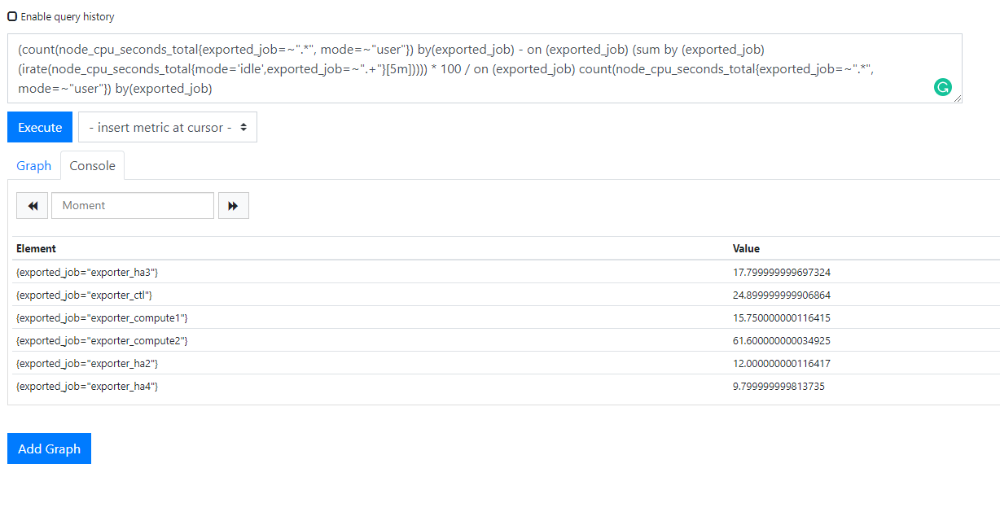
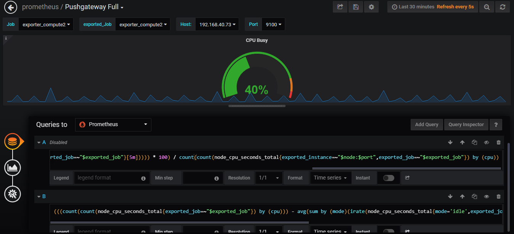
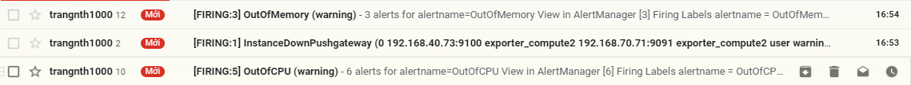
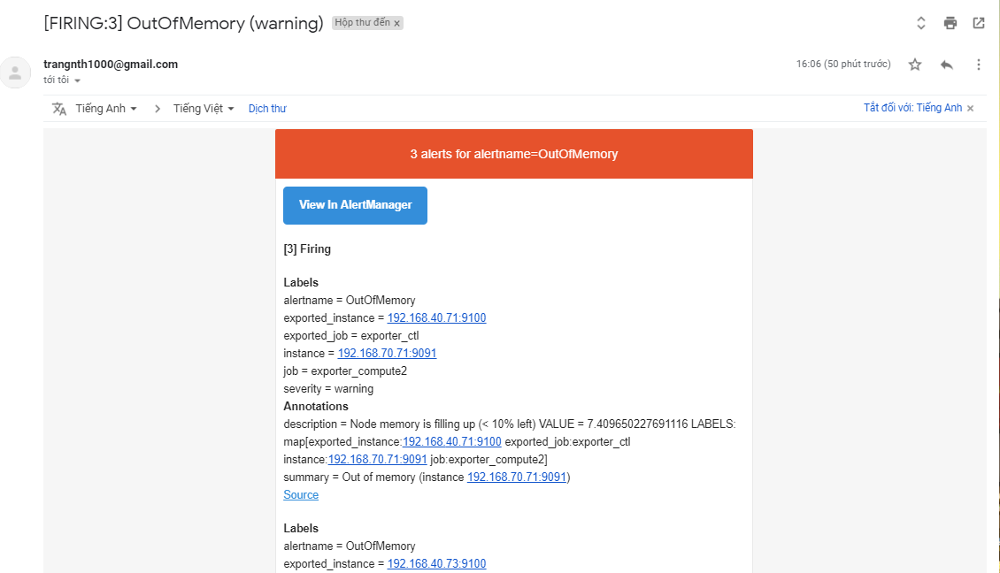
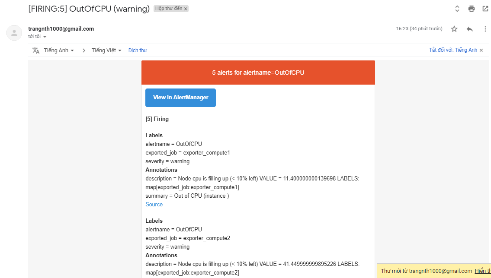

# Alerting Rules

Alerting rules cho phép định nghĩa các điều kiện alert dựa trên Prometheus expression language expressions và gửi cảnh báo về một external service. Bất cứ khi nào alert expression results trong một hoặc nhiều vector thành phần tại một thời điểm, các cảnh báo được hoạt động như việc thiết lập các labels cho các thành phần đó.

## Defining alerting rules

Alerting rules được cấu hình trong Prometheus tương tự với recording rules.

Ví dụ một file cấu hình với một alert như sau:

```sh
groups:
- name: example
  rules:
  - alert: HighRequestLatency
    expr: job:request_latency_seconds:mean5m{job="myjob"} > 0.5
    for: 10m
    labels:
      severity: page
    annotations:
      summary: High request latency
```

Tùy chọn `for` khiến cho Prometheus phải đợi trong một khoảng thời gian nhất định từ lần đầu tiên match expression output vector element mới tới khi gửi đi một cảnh báo. Trong trường hợp này Prometheus sẽ kiểm tra xem trong vòng 10 phút cảnh báo còn tiếp tục hay không, khi đó các phần tử vẫn hoạt động, đang ở trạng thái pending.

`labels` cho phép chỉ định một tập các labels được bổ sung để attached với alert. Bất cứ một label nào bị trùng lặp sẽ được ghi đè. Giá trị của label có thể được tạo mẫu.

`annotations` chỉ định một tập các thông tin về labels, được sử dụng để lưu trữ các thông tin đầy đủ hơn như để miêu tả việc cảnh báo hoặc runbook links. Các giá trị `annotations` này cũng có thể được tạo mẫu.

## Templating

Giá trị label và annotation có thể được tạo mẫu bằng việc sử dụng [Console templates](https://prometheus.io/docs/visualization/consoles/)

Giá trị `$labels` sẽ giữ label key/value pairs của một alert instance. Các external labels được cấu hình có thể accessed qua giá trị `$externalLabels`. Gia trị `$value` dùng để giữ các giá trị được đánh giá của một alert instance.

```sh
# To insert a firing element's label values:
{{ $labels.<labelname> }}
# To insert the numeric expression value of the firing element:
{{ $value }}
```

Ví dụ:

```sh
groups:
- name: example
  rules:

  # Alert for any instance that is unreachable for >5 minutes.
  - alert: InstanceDown
    expr: up == 0
    for: 5m
    labels:
      severity: page
    annotations:
      summary: "Instance {{ $labels.instance }} down"
      description: "{{ $labels.instance }} of job {{ $labels.job }} has been down for more than 5 minutes."

  # Alert for any instance that has a median request latency >1s.
  - alert: APIHighRequestLatency
    expr: api_http_request_latencies_second{quantile="0.5"} > 1
    for: 10m
    annotations:
      summary: "High request latency on {{ $labels.instance }}"
      description: "{{ $labels.instance }} has a median request latency above 1s (current value: {{ $value }}s)"
```


**NOTE**

* Ví dụ thực hiện query phần trăm CPU util của tất cả các instance đang đẩy qua pushgateway:

```sh
(count(node_cpu_seconds_total{exported_job=~".*", mode=~"user"}) by(exported_job) 
- on (exported_job) (sum by (exported_job) (irate(node_cpu_seconds_total{mode='idle',exported_job=~".+"}[5m])))) * 100 
/ on (exported_job) count(node_cpu_seconds_total{exported_job=~".*", mode=~"user"}) by(exported_job)
```

Kết quả:



Tương tự với Query trên Grafana: 

```sh
(((count(count(node_cpu_seconds_total{exported_job=~"$exported_job"}) by (cpu))) - avg(sum by (mode)(irate(node_cpu_seconds_total{mode='idle',exported_job=~"$exported_job"}[5m])))) * 100) / count(count(node_cpu_seconds_total{exported_job=~"$exported_job"}) by (cpu))
```



* Cấu hình cảnh báo Ram, CPU, và cảnh báo khi Instance down quá lâu như sau (có thực hiện cấu hình đẩy qua pushgateway):

```sh
[root@trang-70-71 ~]# cat /etc/prometheus/alert.rules.yml
groups:
- name: Instances
  rules:
  # - alert: InstanceDown
  #   expr: up == 0
  #   for: 1h
  #   labels:
  #     severity: page
  #   # Prometheus templates apply here in the annotation and label fields of the alert.
  #   annotations:
  #     description: '{{ $labels.instance }} of job {{ $labels.job }} has been down for more than 5s.'
  #     summary: 'Instance {{ $labels.instance }} down'

  - alert: OutOfMemory
    expr: (node_memory_MemFree_bytes + node_memory_Cached_bytes + node_memory_Buffers_bytes) / node_memory_MemTotal_bytes * 100 < 10
    for: 30s
    labels:
      severity: warning
    annotations:
      summary: "Out of memory (instance {{ $labels.instance }})"
      description: "Node memory is filling up (< 10% left)\n  VALUE = {{ $value }}\n  LABELS: {{ $labels }}"

  - alert: OutOfCPU
    expr: (count(node_cpu_seconds_total{exported_job=~".*", mode=~"user"}) by(exported_job) - on (exported_job) (sum by (exported_job) (irate(node_cpu_seconds_total{mode='idle',exported_job=~".+"}[5m])))) * 100 / on (exported_job) count(node_cpu_seconds_total{exported_job=~".*", mode=~"user"}) by(exported_job) > 90
    for: 30s
    labels:
      severity: warning
    annotations:
      summary: "Out of CPU (instance {{ $labels.instance }})"
      description: "Node cpu is filling up (< 10% left)\n  VALUE = {{ $value }}\n  LABELS: {{ $labels }}"
  
  - alert: InstanceDownPushgateway
    expr: rate(node_cpu_seconds_total{exported_instance=~".+", cpu="0", mode="user"}[5m]) == 0
    for: 1s
    labels:
      severity: warning
    # Prometheus templates apply here in the annotation and label fields of the alert.
    annotations:
      description: '{{ $labels.instance }} of job {{ $labels.job }} has been down for more than 5m.'
      summary: 'Instance {{ $labels.instance }} down'
```

Khởi động lại service:

```sh
systemctl restart prometheus
```

Kết quả:









