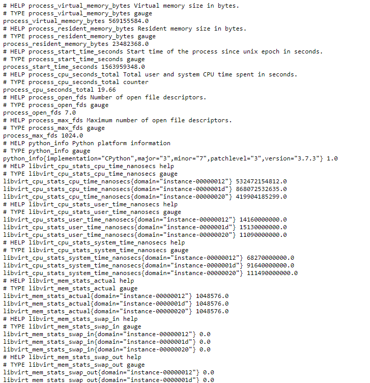
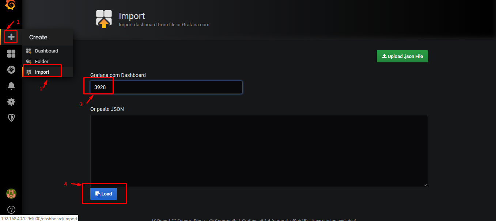
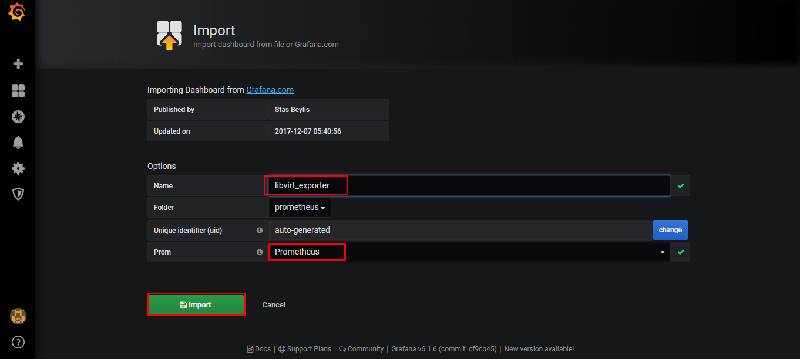
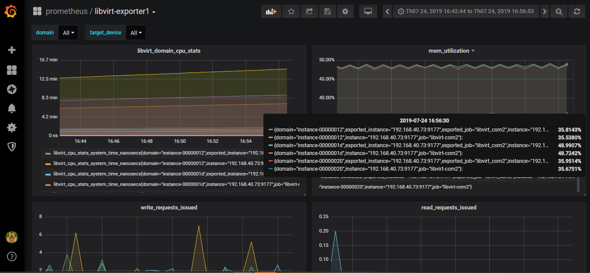
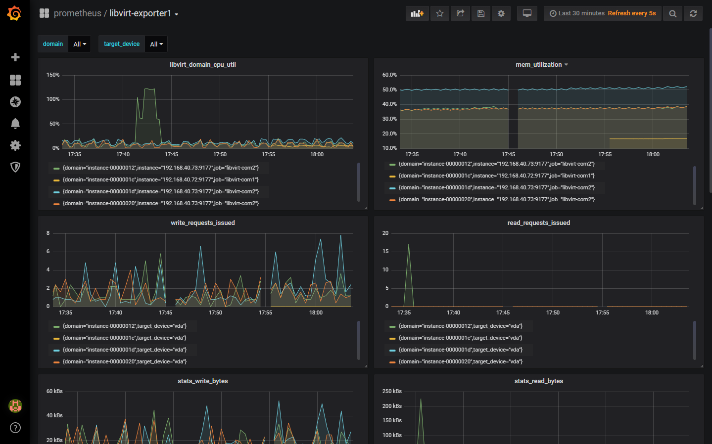

# Prometheus libvirt exporter

Tham khảo từ:

https://github.com/greatbn/prometheus_libvirt_exporter

## Chuẩn bị 

Cài đặt python 3.7

```sh
yum install gcc openssl-devel bzip2-devel libffi-devel -y
cd /usr/src
wget https://www.python.org/ftp/python/3.7.3/Python-3.7.3.tgz
tar xzf Python-3.7.3.tgz
cd Python-3.7.3
./configure --enable-optimizations
make altinstall
rm -f /usr/src/Python-3.7.3.tgz
```

## Cấu hình và cài đặt exporter

```sh
cd /root
git clone https://github.com/trangnth/prometheus_libvirt_exporter.git
cd prometheus_libvirt_exporter/
pip3.7 install --upgrade pip
yum install -y libvirt libvirt-devel
pip install -r requirements.txt
```

Chạy exporter:

```sh
python3.7 libvirt_exporter.py -si 3
```

Kiểm tra trên web với địa chỉ: http://192.168.40.73:9177/



## Cấu hình trên prometheus server 

Chỉnh sửa file cấu hình `/etc/prometheus/prometheus.yml`:

```sh
  - job_name: 'libvirt-com2'
    scrape_interval: 5s
    static_configs:
      - targets: ['192.168.40.73:9177']
```

**Chú ý**: Thay đổi `job_name` và `targets` cho phù hợp

Khởi động lại dịch vụ:

```sh
systemctl restart prometheus
```

## Add dashboad trên grafana

Truy cập vào địa chỉ của grafana: http://192.168.40.129:3000 sau đó thực hiện theo các bước sau:



Đặt tên cho Dashboard và chọn database phù hợp sau đó import.



Kết quả:



Chỉnh sửa dashboard một chút để có được thông số cpu_util


