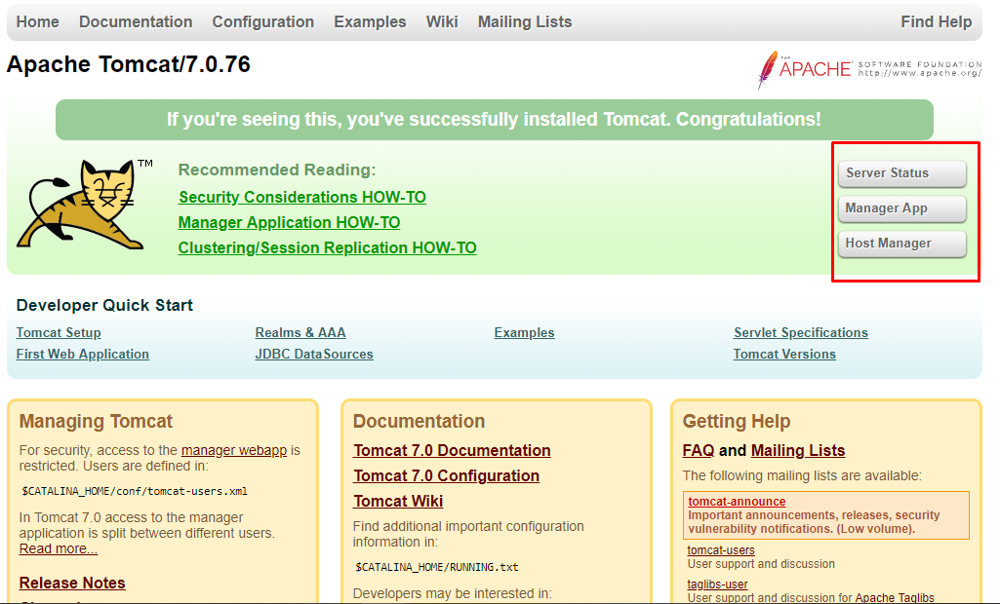
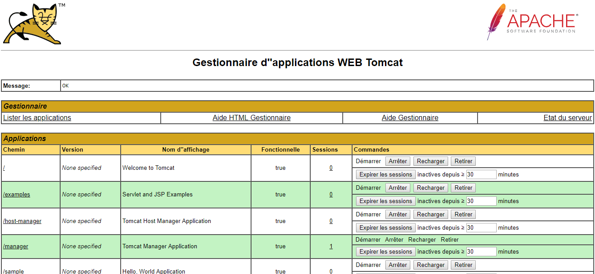
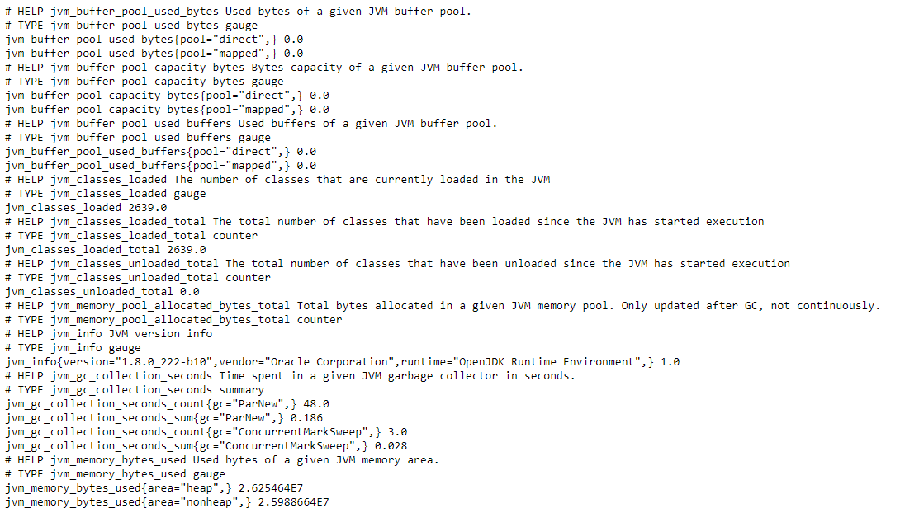
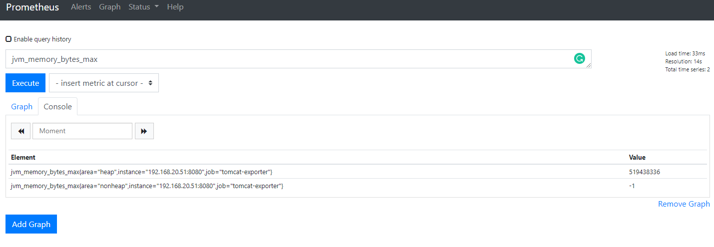

# Tomcat exporter 

## 1. Cài đặt Tomcat 7 trên CentOS 7

Cài đặt tomcat:

```sh
sudo yum install tomcat -y
```

Kiểm tra phiên bản JAVA:

```sh
[root@trang-20-51 ~]# java -version
openjdk version "1.8.0_222"
OpenJDK Runtime Environment (build 1.8.0_222-b10)
OpenJDK 64-Bit Server VM (build 25.222-b10, mixed mode)
```

Install Admin Packages

```sh
sudo yum install tomcat-webapps tomcat-admin-webapps -y
```

Configure Tomcat Web Management Interface:

```sh
$ sudo vi /usr/share/tomcat/conf/tomcat-users.xml
<tomcat-users>
	<user username="admin" password="trang1234" roles="manager-gui,admin-gui"/>
</tomcat-users>
```

Khởi động dịch vụ:

```sh
sudo systemctl start tomcat
sudo systemctl restart tomcat
sudo systemctl enable tomcat
```

Truy cập vào địa chỉ web của tomcat theo đường dẫn: `http://server_IP_address:8080` 



Truy cập `http://server_IP_address:8080/manager/html` nhập username/password đã cấu hình ở trên để truy cập (admin:trang1234)



## 2. Cấu hình Tomcat làm exporter 

Sử dụng một số các thư viện sau:

* [simpleclient](https://search.maven.org/#search%7Cga%7C1%7Ca%3A%22simpleclient%22)
* [simpleclient_common](https://search.maven.org/#search%7Cga%7C1%7Ca%3A%22simpleclient_common%22)
* [simpleclient_servlet](https://search.maven.org/#search%7Cga%7C1%7Ca%3A%22simpleclient_servlet%22)
* [simpleclient_hotspot](https://search.maven.org/#search%7Cga%7C1%7Ca%3A%22simpleclient_hotspot%22)
* [tomcat_exporter_client](https://search.maven.org/#search%7Cga%7C1%7Ca%3A%22tomcat_exporter_client%22)

Tải và đặt các thư viện trên vào thư mục `$CATALINA_BASE/lib` ví dụ nó thường được đặt ở `/usr/share/tomcat/lib`

Tiếp tục tải war file [tomcat_exporter_servlet](https://search.maven.org/#search%7Cga%7C1%7Ca%3A%22tomcat_exporter_servlet%22) và đổi tên thành `metrics.war` đặt trong webapps directory of Tomcat (`/usr/share/tomcat/webapps`)

```sh
[root@trang-20-51 tomcat]# ll webapps/
total 8
drwxr-xr-x. 8 tomcat tomcat  127 Aug  8 17:17 examples
drwxr-xr-x. 5 root   tomcat   87 Aug  8 17:17 host-manager
drwxr-xr-x. 5 root   tomcat  103 Aug  8 17:17 manager
drwxr-xr-x. 4 tomcat tomcat   37 Aug  9 11:43 metrics
-rw-r--r--. 1 root   root   3483 Feb  2  2019 metrics.war
drwxr-xr-x. 3 tomcat tomcat 4096 Aug  8 17:17 ROOT
drwxr-xr-x. 5 tomcat tomcat   86 Aug  8 17:17 sample
```

Khởi động lại service:

```sh
systemctl restart tomcat
```

Truy cập vào địa chỉ sau để kiểm tra `http://192.168.20.51:8080/metrics/`



## 3. Thực hiện cấu hình trên Prometheus

Chỉnh sửa file cấu hình Promethues `/etc/prometheus/prometheus.yml`, thêm vào các dòng sau thể thực hiên scrape metric về:

```sh
  - job_name: 'tomcat-exporter'
    scrape_interval: 5s
    static_configs:
      - targets: ['192.168.20.51:8080']
```

Thực hiện truy vấn trên Prometheus:



## 4. Thực hiện vẽ dashboard trên grafana

[updating...]


## Tham khảo

[1] https://www.digitalocean.com/community/tutorials/how-to-install-apache-tomcat-7-on-centos-7-via-yum

[2] https://tecadmin.net/steps-to-install-tomcat-server-on-centos-rhel/

[3] https://github.com/nlighten/tomcat_exporter/blob/master/README.md

[4] https://stackoverflow.com/questions/53313652/configure-tomcat-exporter