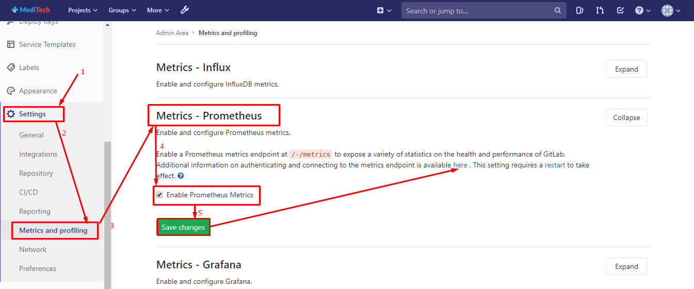
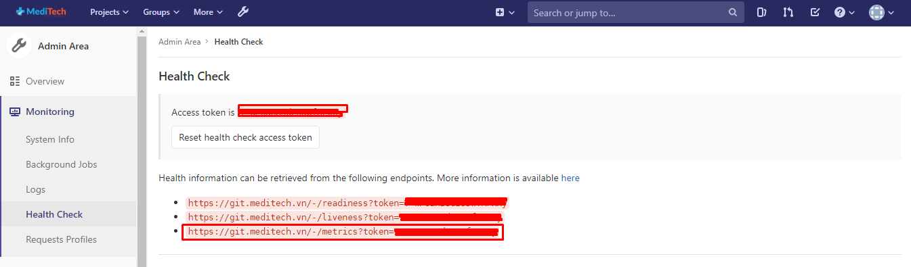
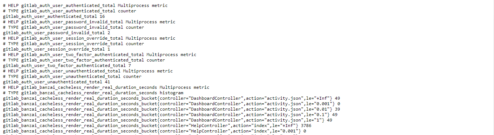
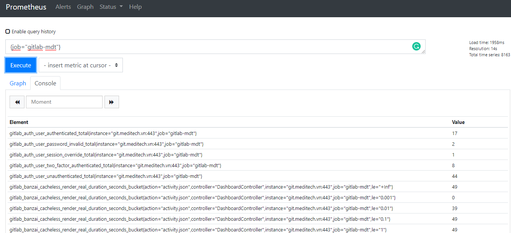

# Prometheus lấy metrics từ gitlab

## Cấu hình trên gitlab

* Cấu hình gitlab phơi metric, chọn theo như hình vẽ



* Sau khi lưu lại thay đổi, bấm vào `here` để xem link metric được export 



* Link metric sẽ có định dạng `https://git.meditech.vn/-/metrics?token=Y-ddddHBSdzsssss`. Truy cập vào link đó, ta có thể thấy các metrics dạng như sau:




## Cấu hình Prometheus

* Với định dạng link như trên, ta cần cấu hình hơi khác so với các bài trước một chút, thay đổi một số các cấu hình sẵn. Ví dụ, mặc định trong cấu hình, `metrics_path` là `/metrics`, ở phần đây ta cần đổi thành `/-/metrics`

* Thêm job trong file cấu hình `/etc/prometheus/prometheus.yml` của prometheus như sau:

```sh
scrape_configs:
...
  - job_name: 'gitlab-mdt'
    scrape_interval: 5s
    static_configs:
      - targets: ['git.meditech.vn']
    metrics_path: /-/metrics
    scheme: https
    params:
      token: ['Y-ddddHBSdzsssss']
...
```

* Khởi động lại service

```sh
systemctl restart prometheus
```

* Truy cập vào giao diện web của prometheus để xem các metric đã được lấy về hay chưa: http://192.168.70.71:9090/prometheus/graph



* Với `192.168.70.71` là ip của prometheus server 


## Tham khảo

[1] https://docs.gitlab.com/ee/administration/monitoring/prometheus/

[2] https://docs.gitlab.com/ee/administration/monitoring/prometheus/gitlab_metrics.html


